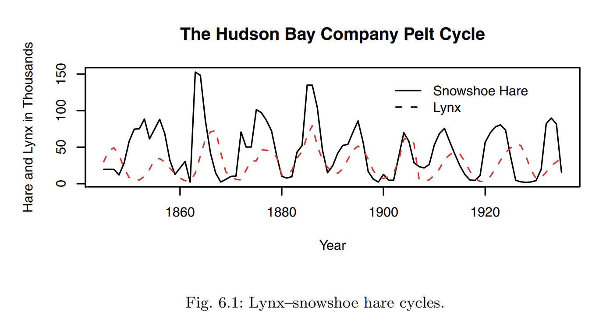

```{r setup, include=FALSE}

rm(list = ls())

library(ggplot2)

```

# Predator-Prey Interactions

We will now begin looking at interactions between multiple species. Throughout this lab, we will model predator/prey interactions in increasingly complex and realistic ways. We will start with simple functional responses, then move to Lotka-Volterra models and Rosenzweig-MacArthur models.

## Functional Responses

$aN$ describes the rate at which a prey kills/consumes its prey (population size $N$) at an attack rate $a$.

So $aN$ can be used to describe the functional response of a single individual predator. We can plot the number of prey available by the number of prey killed per unit time:

```{r}

a <- 0.1
df <- data.frame(N = c(0, 10))

ggplot(data = df, aes(x = N)) +
  stat_function(fun = function(N) a * N) +
  labs(x = "Prey Density", y = "Prey Killed Per Predator")

```

::: callout-tip
### Anonymous Functions in `ggplot2` with `stat_function()`

Just like we saw in the previous lab with the `sapply()` function, `stat_function(fun = function(x) x)` provides a way to use an **anonymous function** in `ggplot2`. Remember, anonymous functions are unnamed functions used directly in code for quick calculations or plots. In this case: - `x` inside the function parentheses is the parameter passed to the function. - `x` after the `function(x)` term defines the actual function

These functions are useful for adding simple curves or expressions directly to your plots without creating a separate named function.
:::

Do you think the trend seen in this curve is realistic in nature? Why or why not?

Type II responses are more frequently seen in nature:

$$
\frac{aN}{1 + ahN}
$$

What are each of the terms in this equation?

-   $a$ = attack rate
-   $P$ = predator population
-   $h$ = handling time

When are Type II responses seen in nature?

Now plot a Type II functional response with a handling time of 50:

```{r}


```

In contrast, when do we typically see Type III responses?

$$
\frac{\frac{1}{h}N^{2}}{(\frac{1}{ah})^{2} + N^{2}} = \frac{cN^{2}}{d^{2} + N^{2}}
$$

Where $c = \frac{1}{h}$ is the maximum consumption rate and $d = \frac{1}{ah}$ is the half-saturation constant.

Plot a Type III functional response with `d = 3.5` and `c = 0.02`:

```{r}


```

Here is an alternative equation to represent functional response curves:

$$
F = \frac{bN^{1+q}}{1+bhN^{1+q}}
$$

As another way to represent functional response curves, the code below is represented as a dataframe.

```{r, echo = FALSE}

# Create a data frame for plotting
df <- data.frame(N = seq(0, 50, length.out = 100))

```

What do you notice as you vary the values of the terms for your plot?

```{r}

# set parameters


# plot


```

------------------------------------------------------------------------

## Agent-Based Models

Explore the agent-based model below:

::: callout-tip
## Agent-based Models

Compared to other simulation types that attempt to simulate systems as a whole, agent-based models are a type of simulation where the behavior of **individual units (agents)** are simulated. This allows us to observe the additive result of how individual behaviors and/or interactions might affect the system as a whole.
:::

```{=html}
<iframe src="Wolf_Sheep_Grass_Predation.html" data-external="1" style="width:100%; width:100vw; width:100dvw; height:100%; height:100vh; height:100dvh;"></iframe>
```

```{html include = FALSE}
[Link to ABM Predation Model](https://charleslehnen.github.io/BISC_499_Ecology_and_Biodiversity/Lab_4/Wolf_Sheep_Grass_Predation.html)
```

Select the model version `sheep-wolves`. Click `setup` to set-up the model based on your parameters. Use the `go` button to start and stop the simulation.

What do you notice about the synchronicity between the sheep and wolf populations?

This is seen throughout predator-prey dynamics, including the famous lynx--snowshoe hare cycle, based on data from the Hudson Bay Trading.



Challenge: Modify the parameters to stabilize the system so that neither population becomes extinct. What do you find?

Change the model version to `sheep-wolves-grass`. Before running the simulation, what do you expect to happen?

Now run the simulation and modify the parameters to stabilize the system.

What do you find?

Why is this the case?

------------------------------------------------------------------------

## Lotka-Volterra Models

In R, we can construct a simple Lotka-Volterra model to simulate single predator/prey interactions.

$$
 \begin{array}{l}
\frac{dN}{dt} \ =\ rN\ -\ aNP\\
\\
\frac{dP}{dt} \ =\ faNP\ -\ qP
\end{array}
$$

These terms refer to:

$$
 \begin{array}{l}
r\ =\ prey\ per\ capita\ growth\ rate\\
N\ =\ number\ of\ prey\ species\ individuals\\
a\ =\ per\ capita\ attack\ rate\\
P\ =\ number\ of\ predator\ species\ individuals\\
f\ =\ predator\ efficiency\\
q\ =\ predator\ per\ capita\ mortality\ rate
\end{array}
$$

Remember from last lab, $r$ is generally used for continuously reproducing populations

In the absence of a predator, would the terms for prey population growth be density dependent or independent?

It is just a growth rate and the population size like we saw last lab in our density independent formula:

$$
N_{t} \ =\ r N_{0}
$$

Now let's create a function for the Lotka-Volterra model in R. We can write differential equations in R using the ordinary differential equation (ODE) package `deSolve`[@deSolve] following the format:

``` r
function_name <- function(y, x, parameters) {
  X <- x[1]
  with(as.list(params), {
    dX.dy <- X # complete formula here
    return(list(c(dX.dy)))
  })
}
```

R's ordinary differential equation (ODE) solver deSolve() can be used to analyze population growth. ODEs are commonly used to calculate rates of change in order to model dynamic systems.

::: callout-note
If you have trouble installing, try the following:

``` r

install.packages("https://cran.r-project.org/src/contrib/deSolve_1.34.tar.gz", repos=NULL, type="source")}
```

If after restarting Rstudio/R that does not work, try the following:

``` r

library(devtools)  # Double check the most up to date version 
install_version("deSolve", version = "1.34", repos = "http://cran.us.r-project.org")}
```

If neither option works and you are using a Mac, you can try the following in a Homebrew command line:

``` bash
 brew install wget wget https://cran.r-project.org/src/contrib/deSolve_1.34.tar.gz R CMD INSTALL deSolve_1.34.tar.gz
```
:::

Now you try to use this format to define an ODE function for the prey (`dN.dt`) and predator (`dP.dt`) Lotka-Volterra models named `lotka_volterra`

```{r}


```

::: callout-tip
## Namespaces in R

In the example below we call an example using this format `package::function().`

Namespaces are used to organize functions, data, and other objects within a package. The double colon operator allows us to *explicitly* access a namespace within a specified package.

We are *implicitly* accomplishing this same task whenever we run a package function or access a package dataset after loading that package using `library()` or `require()`. The double colon allows us to do these same tasks explicitly, either to avoid conflicts with a function/dataset from another package with the same name (as above) or to be more explicit programmers.
:::

Now let's run our model and observe the outcome:

```{r}

library(deSolve)

parms <- c(
  r = 0.5,
  a = 0.01,
  f = 0.1,
  q = 0.2  
)

Time <- seq(0, 200, by = 0.1)

lotka_volterra.out <- deSolve::ode(c(N0 = 25, P0 = 5), times = Time, func = lotka_volterra, parms = parms)

df_lotka_volterra <- data.frame(Time, lotka_volterra.out)

ggplot(df_lotka_volterra, aes(x = Time)) +
  geom_line(aes(y = P0), color = "red") +
  geom_line(aes(y = N0), color = "black") +
  labs(x = "Time", y = "Population Size")

```

What do you notice about the plot?

Now take some time to alter the parameters, including the starting population size, and observe what happens. Also note if you are able to have populations fully stabilize to a node or if they continue to oscillate?

------------------------------------------------------------------------

## Rosenzweig-MacArthur Models

Michael Rosenzweig (a graduate student at the time) and his adviser Robert MacArthur had issues with the applicability of the Lotka-Volterra in natural systems.

Especially the often inaccurate assumptions we have discussed in the past two labs: the Type I response of predators and the density-independence of prey populations. Because of these, Rosenzweig and MacArthur made the following changes to the model:

1.  Predators would be unlikely to follow a Type I response due to:

    -   Predators would become satiated *and/or*

    -   Handling time (`h`) would physically limit the number of prey a predator could consume

2.  In the absence of predators, prey would become self limiting (density-dependent)

These changes can be integrated into the predator portion of the Lotka-Volterra formula as:

$$
\frac{dP}{dt} \ =\ \frac{faNP}{1\ +\ ahN} \ -\ qP
$$

As for the prey portion, we can add the handling time as follows:

$$
\frac{dN}{dt} \ =\ rN\ -\ \frac{aNP}{1\ +\ ahN}
$$

Remember from last lab we modeled density-dependent growth. How would we incorporate density-dependence into the Lotka-Volterra model formula?

$$
\frac{dN}{dt} \ =\ rN\left( 1\ -\ \frac{N}{K}\right)
$$

Therefore, to incorporate into our model we would write:

$$
\frac{dN}{dt} \ =\ rN\left( 1\ -\ \frac{N}{K}\right) \ -\ \frac{aNP}{1\ +\ ahN}
$$

Now put this all together and integrate these additional parameters into the Lotka-Volterra R function we constructed above to write the function `rosenzweig_macarthur`.

```{r}

```

Then, call this function using the `deSolve::ode` function like we did above with `h <- 0.1` and `K <- 1000` (keep other parameters the same) and plot with `ggplot2`.

```{r}


```

Modify the new parameters of handling time and carrying capacity that we just introduced into our model. Make a hypothesis and then test it by modfiying the parameters

```{r}


```

What do you observe?

What happens if we increase predator efficiency? Make a hypothesis and then test it by modfiying the parameters

```{r}


```

What do you observe?
