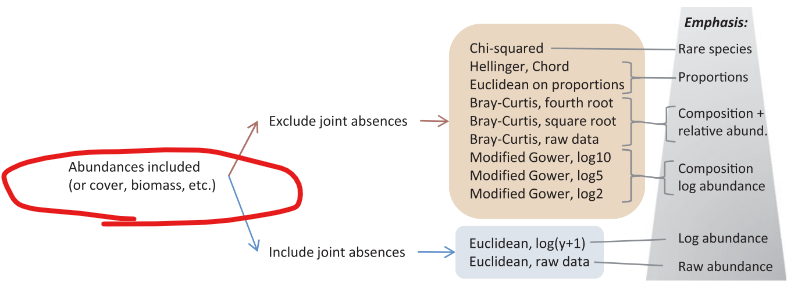
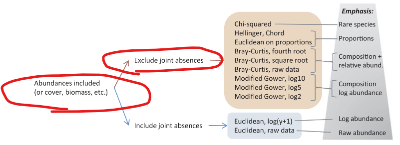
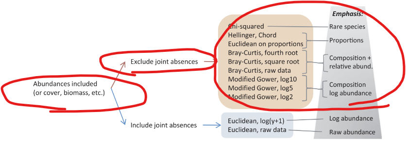
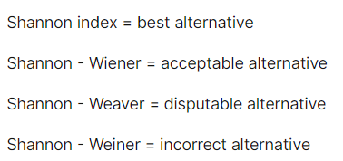
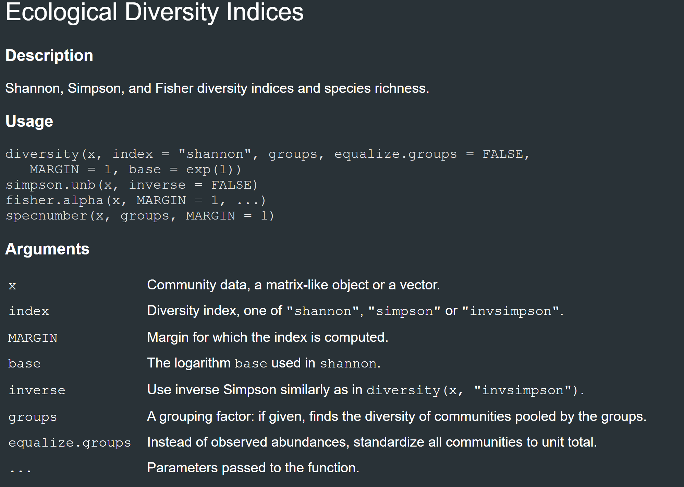

```{r setup, include=FALSE}

knitr::opts_chunk$set(echo = TRUE)

rm(list=ls())

library(dplyr)
library(ggplot2)
library(tidyr)
library(plotly)

library(vegan)

```

# Biodiversity

There are many ways to measure biodiversity and to compare these metrics between populations or communities. The simplest two are often considered to be richness and abundance.

## Richness

Do you remember the difference between richness and abundance?

-   

Do you remember the three ways we have talked about measuring diversity this semester?

-   

### Gamma Diversity


It's time to collect data along a transect! Create a dataframe for this dataset across the five vegetation zones which follow an elevation gradient:

```{r}

# Directly creating the long format dataframe

df <- data.frame(
  
  plot_id = c(1, 1, 1, 1, 1,
              2, 2, 2, 2, 2,
              3, 3, 3, 3, 3,
              4, 4, 4, 4, 4,
              5, 5, 5, 5, 5),
  
  species_id = c("triangle_sp", "square_sp", "cross_sp", "circle_sp", "x_sp",
                 "triangle_sp", "square_sp", "cross_sp", "circle_sp", "x_sp",
                 "triangle_sp", "square_sp", "cross_sp", "circle_sp", "x_sp",
                 "triangle_sp", "square_sp", "cross_sp", "circle_sp", "x_sp",
                 "triangle_sp", "square_sp", "cross_sp", "circle_sp", "x_sp"),
  
  count = c()
)


```

```{r}

head(df)

```

What is the species richness of our region?

```{r}

# There are various ways to accomplish this. Here are a couple examples of methods


```

-   

This total count of species richness across a region is referred to as $\gamma$ **diversity**.

](../images/clipboard-242309333.png){fig-align="center"}

### Alpha Diversity

Similarly, $\alpha$ **diversity** is the richness of a local area or a single sample.

Calculate the $\alpha$ diversity of plots 4 and 5 using a `dplyr` pipe

```{r}


```

How similar are these plots? How distinct are they? Is this value or high or low for our region?

-   

Calculating $\beta$ diversity can begin to help us explore these nuances.

### Beta Diversity

$\beta$ **diversity** can be defined as

-   The number of species in a region *not* observed in a given sample *or*

-   The turnover in species composition among sites across a region

Therefore both $\alpha$ (site) and $\gamma$ (regional) diversity are directly related to $\beta$ diversity.

$\beta$ diversity serves as a crucial bridge connecting local biodiversity ($\alpha$ diversity) with the wider regional species pool ($\gamma$ diversity). Examining beta diversity is central to community ecology, as it explores the factors that cause species assemblages to vary in similarity across various locations and times.

It is a very popular metric whose nuances are still being explored and perfected for specific scenarios:

![Source: Anderson et. al 2011[@anderson2011navigating]](../images/clipboard-899710379.png){fig-align="center"}

#### Classical Beta Diversity Metrics

In its simplest and original form, turnover was calculated via **multiplicative partitioning**:

$$
\beta \ =\ \frac{\gamma }{\overline{\alpha }}
$$

Where $\overline{\alpha }$ is the average $\alpha$ diversity of the sample. This formula is similar to the original definition coined by Whittaker[@whittaker1960vegetation].

The second traditional way $\beta$ diversity was calculated was via **additive partitioning**.

$$
\beta \ =\ \gamma \ -\ \overline{\alpha }
$$

Here, $\beta$ diversity is the average number of species *not* found in a sample, even though they are found in that region.

We will calculate the $\beta$ diversity of sites 4 and 5. To help us do so, we will introduce you to the currently most popular community ecology package in R, `vegan` [@vegan].

```{=html}
<iframe src="../images/vegan_cheatsheet.pdf" style="width:60%; width:60vw; width:60dvw; height:100%; height:100vh; height:100dvh;"></iframe>
```

First, we will need to reformat the data into the format that `vegan` prefers called a "community data matrix," with *only* species names as column names, sampling events down the Y-axis, and abundances where they meet.

For example, imagine you have a day of sampling in a single plot in the field. You would tally the amount of each species you see that day in that same row.

Inspect our dataframe `df`

```{r}

df

```

Are there any changes that need to be made in order for this dataframe to be in community data matrix format?

-   

The table is in long format so we will need to widen the dataframe by species name. In general data collection and data presentation should be done in a long format since it is more human-readable, whereas analysis should be done in the wide format since it is more easily computer readable.

To do so, we will use the `tidyR`[@tidyr] `pivot_wider()` function.

](../images/clipboard-3433872329.png){fig-align="center" width="681"}

```{r}

comm_data_matrix <- df %>%
  pivot_wider()

comm_data_matrix

```

Remember, community data matrices require columns to *only* represent species, so you must `select()` for only species columns before passing a dataframe to `vegan`.

```{r}


  
```

With this information, create separate community data matrices (`df_1`, `df_4`, `df_5`) for sites 1, 4, and 5 respectively using `filter(row_number() == <row number>)` or the `slice()` function from `dplyr`

```{r}


```

To calculate $\overline{\alpha }$, use the `vegan` function `specnumber()`:

``` r
alpha_bar <- mean(specnumber(df))
```

Do this to create the objects `alpha_bar_1`, `alpha_bar_4`, and `alpha_bar_5`

```{r}


```

Use these objects and the gamma diversity we calculated above to calculate additive and multiplicative beta diversity for each plot:

```{r}


# Calculate additive beta diversity for each plot


```

```{r}

# Calculate multiplicative beta diversity for each plot


```

What do these results imply?

-   

#### Jaccard and Sørenson Indices to Calculate Beta Diversity

For more exact estimates of $\beta$ diversity, we can calculate the **Jaccard** and **Sørenson** distances. These distances are both measures of similarity between two sites, with the Jaccard index being a measure of similarity and the Sørenson index being a measure of dissimilarity.

Let's start with Jaccard. Jaccard only considers presence/absence, not abundance. Sites that are most similar are closer to 0 and those that are most different are closer to 1.

```{r}

# Calculate Jaccard distance
jaccard_dist <- vegdist(comm_data_matrix, method = "jaccard")

jaccard_dist


```

Which plots are are most similar and which are different? Does this match your intuition?

Now let's do Sørenson which ranges from 0 (identical) to 1 (completely dissimilar). It also uses presence/absence as an input.

```{r}

# Calculate Sørensen distance
# Sørensen is equivalent to "bray" method with binary data in vegdist
sorensen_dist <- vegdist(comm_data_matrix, method = "bray", binary = TRUE)

sorensen_dist

```

Which plots are are most similar and which are different? Does this match your intuition?

#### Other Methods to Calculate Beta Diversity

You must be intentional about which version of $\beta$ diversity is applicable to your question and system. Many options are available and continue to be developed/popularized for calculating $\beta$ diversity for different scenarios. Based on our dataset and this flowchart, which method(s) might be the best for calculating $\beta$ diversity in our case?

![Source: Anderson et. al 2011[@anderson2011navigating]](../images/clipboard-2492413799.png){fig-align="center"}

-   We have not yet considered abundances. However, since we have abundance data we can integrate it into our calculation of $\beta$ diversity to more accurately differentiate between communities.
    -   
-   It is likely that we want to exclude joint absences. With the low number of species in our survey, there are many more species in the world that our system is lacking than it includes. Therefore, what species *are in* our plot gives us more information than what is *not* in our plot.
    -   
-   Choosing our exact method for calculation will depend on our research question. Are we most interested in rare species or the proportion of species? Are we more interested in relative abundance or log abundance (for example, is there a large difference between abundances)?
    -   

\
We will explore abundance metrics in the following section

------------------------------------------------------------------------

## Abundance

Remember, **richness** is the number of species in a community while **abundance** is the number of individuals from each species in that community.

How can we find abundance within the community we are studying?

-   

Use `dplyr` to group our long dataframe `df` by `species_id` and use `mutate()` to create a column of total abundances called `total_count`.

```{r}


```

Plot the total abundances of our `df` as a barplot using ggplot2[@ggplot2].

```{r}


```

What do you notice about the abundances?

-   

### Rank Abundance Curves

Rank abundance curves are a common way to visualize the distribution of species abundances in a community. They are a type of species accumulation curve, which are used to estimate the number of species in a community. They give you a quick way to compare how similar/different communities are just based on simple abundances.

```{r, warning = FALSE}

# Rank abundances of each species within each plot
df %>%
  group_by(plot_id, species_id) %>%
  summarize(plot_count = sum(count)) %>%
  arrange(plot_id, desc(plot_count)) %>%
  mutate(rank = row_number()) %>%
  ungroup()
  ggplot(, aes(x = rank, y = plot_count, color = factor(plot_id))) +
    geom_point() +
    geom_line() +
    labs(x = "Abundance Rank (log scale)", y = "Abundance (log scale)", color = "Plot ID")

```

What do you notice?

-   

### Distances

For simple distances to compare plots, we need to select only 2 species compositions to compare between plots because basic plots are 2-dimensional.

Let's plot for species "triangle_sp" vs. "circle_sp" for plots 1, 3, and 4 from our `comm_data_matrix`.

```{r}


```

Can you tell by looking at this plot how different the relationship is between these species by site?

-   

#### Euclidean Distance

We can calculate the distance between plots to quantify how different they are. In general, distances in ecology are primarily used to quantify dissimilarity. The first method is calculating the **Euclidean distance** between points. We just look at this x, y coordinate plot as a map. Therefore, this distance can be calculated with

$$
\sqrt{( x_{1} \ -\ x_{2})^{2} \ +\ ( y_{1} \ -\ y_{2})^{2}}
$$

Calculate the Euclidean distance between plots 1 and 3 for our df `df_tri_cir`

```{r}

x1 <- df_tri_cir$triangle_sp[1]
x2 <- df_tri_cir$triangle_sp[2]
y1 <- df_tri_cir$circle_sp[1]
y2 <- df_tri_cir$circle_sp[2]

```

```{r}

# Calculate Euclidean distance


```

Repeat this for plots 3 and 4

```{r}


```

```{r}


```

What do these results imply?

-   

#### Bray-Curtis Distance

However, this Euclidean distance can quickly focus too heavily on more abundant species over rare species. To prevent this by weighing abundant and rare species evenly, we can calculate the abundances between two sites divided by the total abundances at each site. This is called the **Bray-Curtis** distance.

$$
\sum \frac{|x_{ai} \ -\ x_{bi} |}{x_{ai} \ +\ x_{bi}}
$$

The `vegdist()` function from the `vegan` package provides Bray-Curtis distance by default for an entire dataset. Filter for plots 1 and 3, select for "triangle_sp" and "circle_sp", and use the `vegdist()` function with `method = "euclidean"` to check our previous answer. The `slice()` function from `dplyr` is a straightforward way to filter for rows based on row number, especially for multiple rows.

```{r}

df_tri_cir_cm <-

```

```{r}

vegdist(df_tri_cir_dcm, method="euclidean")

```

Now repeat using the Bray-Curtis distance

```{r}

vegdist(df_tri_cir_dcm, method="bray")

```

Repeat for plots 3 versus 4, what do you notice in comparison to Euclidean distance results?

```{r}


```

-   

#### Non-metric Multidimensional Scaling

We have focused on pairs of 2 species, but our dataframe has more than 2 columns. Let's plot 3 columns (species "triangle_sp", "circle_sp", and "square_sp") for plots 1, 3, and 4. Wrangle data to create `df_tri_cir_sq` object.

```{r}


```

Now that we have 3 species, we can plot them in 3 dimensions.

```{r}


# Convert to plotly 3D scatter plot
plot_ly(data = df_tri_cir_sq, x = ~triangle_sp, y = ~circle_sp, z = ~square_sp, type = 'scatter3d', mode = 'markers') %>%
  layout(scene = list(xaxis = list(title = 'triangle_sp'),
                      yaxis = list(title = 'circle_sp'),
                      zaxis = list(title = 'square_sp'),
                      camera = list(
                        eye = list(x = 0, y = 0, z = 2.5),
                        up = list(x = 0, y = 1, z = 0)
                      )))

```

At first this plot looks identical to our plot above of "triangle_sp" vs "circle_sp," however when we rotate we can see the third dimension. Although this looks pretty cool, it is even harder to visually inspect how similar/different these plots are.

Now, how can we visualize 4 or more columns (species "triangle_sp", "circle_sp", "square_sp", and "species_x") to see their distance for plots 1, 3, and 4? How about 5 columns?

One technique that attempts to visualize an optimal arrangement is **Non-metric Multidimensional Scaling (NMDS).** Note that the axes of the plotted results are arbitrary (non-metric) but instead represent the relative weight of relationships.

NMDS is an example of an ordination technique, which allow us to arrange multidimensional data and reduce it to low-dimensional space based on their similarities or dissimilarities. This is very useful for visualizing and analyzing complex data.

All of these ordination methods do something more or less similar to the following visualization of a simple PCA, they look at multivariate point cloud from a certain angle and take a 2D slice through that plane:

](../images/clipboard-4032541666.png){fig-align="center"}

Once again, `vegan` can help with this, among other options it can produce NMDS plots by either Euclidean or Bray-Curtis distance.

```{r}

# Wrangle


```

```{r}

nmds_Euc <- metaMDS(df_tri_cir_sq_x, distance = "euclidean")

scores_plot_df <- as.data.frame(scores(nmds_Euc, display = "sites"))

scores_plot_df <- scores_plot_df %>%
  mutate(plot_id = c(1, 3, 4))

```

```{r}

# Plot


```

Now repeat for Bray-Curtis distance

```{r}

# Repeat for Bray-Curtis distance


```

Compare this to our original 2D plot where we used triangle and circle species to try to compare plots, are there any differences that you notice?

```{r}

df_tri_cir <- comm_data_matrix %>%
  select(triangle_sp, circle_sp) %>%
  mutate(plot_id = row_number()) %>%
  filter(plot_id == 1 | plot_id == 3 | plot_id == 4)

ggplot(data = df_tri_cir, aes(x = triangle_sp, y = circle_sp)) +
  geom_text(aes(label = plot_id)) +
  labs(x = "triangle_sp", y = "circle_sp", title = "Abundances of triangle_sp vs. circle_sp")

```

NMDS plots can go well beyond 4-dimensions. Because of this expandability, we can plot distances for all species in our sample simultaneously to identify which plots may be more different from one another as far as species abundances is concerned.

```{r}

# Repeat creating NMDS using Bray-Curtis distance for all species


```

What hypotheses can we make based on this plot?

-   

Again, NMDS is an example of an ordination technique, other examples include:

-   **Principal Component Analysis (PCA)** is primarily used for uncovering patterns in data by reducing its dimensions linearly, without considering external variables.
-   **Canonical Correspondence Analysis (CCA)** to explore the relationships between two sets of variables, particularly when one set is hypothesized to influence the other.
-   **Principal Coordinates Analysis (PCoA)** focuses on preserving the pairwise distances between observations when data is reduced to a lower-dimensional space.

These ordination techniques are used to take into account many aspects, including environmental variables, to make comparisons using multiple dimensions.

------------------------------------------------------------------------

# Diversity Indices

Let's bring our understanding together to quantify diversity using indices. Diversity is challenging to quantify because it is difficult to agree on a definition. For example, we could attempt to quantify biodiversity with any of the following:

-   Probability of encountering a species at random
-   Uncertainty of possible community states
-   Variance in species composition between sites

## Species Richness Index

The most common biodiversity index is the **Species Richness Index**, counting the number of unique species in a community. We already completed this task above, calling it $\gamma$ diversity for our system:

```{r}


```

However, it is highly sensitive to variations in sampling effort because it treats all species equally, weighing rare and common species the same despite the greater likelihood of rare species going undetected.

It does not account for **evenness**: the fact that some species in the community are common and others are rare.

](../images/clipboard-1434634123.png){fig-align="center"}

What do you notice about the examples above?

-   They have equal species richness, however the communities are very different based on evenness.

## Shannon and Simpson Diversity Indices

The **Shannon**[@shannon1948mathematical] and **Simpson Diversity Indices**[@simpson1949measurement], both special cases of the **Hill's Number**[@hill1973diversity], are very popular biodiversity indices because they focus on both richness and evenness.

$$
\begin{array}{l}
Shannon-Wiener\ Diversity\ =-\sum _{i\ =\ i}^{S} p_{i}\ln p_{i}\\
\\
Simpson\ Diversity\ =\frac{1}{\sum _{i\ =\ 1}^{S} \ p_{i}^{2}}\\
\\
p_{i} \ =\ relative\ abundance\ of\ species\ i\\
S\ =\ total\ number\ of\ species
\end{array}
$$

::: callout-note
## What's in a name?

You will likely see the Shannon Index referred to in different ways throughout the literature because of articles/books that were published on the topic by three different mathematicians over the course of a couple of years. Here is a quick guide to the alternative names you will encounter:

{fig-align="center"}
:::

As richness and evenness increase, these indices increase. It is important to remember that Simpson's Diversity Index emphasizes common species, while the Shannon Diversity Index is biased towards rare species. Here is how you can interpret these results:

Shannon's Index interpretation:

-   Shannon's Index is based in information theory and represents the uncertainty that we will be able to predict which species will be randomly drawn from a community.
-   Values of $H$ (Shannon Entropy) are usually between 1.5-3.5 (the units are bits of information)
-   The maximum value of $H$ represents a perfectly even community

Simpson's Index interpretation:

-   Simpson's Index represents the probability that two randomly selected individuals are from the same species.
-   Simpson's Index decreases with increasing richness, because of this Gini-Simpson index ($1 - D$) is often used to make value more comparable with other indices.
-   The values of $D$ range from 0 to 1

Because Simpson's/Gini-Simpson's indices refer more directly to richness than evenness, we can also calculate Simpson's Evenness ("equitability") where $S$ is the number of species:

$$
\frac{1}{D S}
$$

Now let's calculate these values for our dataset. Thanks once again to the `vegan` package, these equations are readily available through the function `diversity()`. Here is the `?vegan::diversity()` help page:

{fig-align="center" width="829"}

Here is another nice summary as well explaining what exactly the `diversity()` function is actually calculating:

](../images/clipboard-1266553944.png){fig-align="center" width="686"}

Wrangle our dataframe `comm_data_matrix` as needed, then compare the richness, Gini-Simpson Index, Simpson's Evenness, and Shannon Index values for plots 1 and 2.

```{r}

# Wrangle data


```

```{r}


# Calculate richness


```

```{r}

# Calculate Gini-Simpson's diversity

diversity(cdm_1, index = "simpson")
diversity(cdm_2, index = "simpson")

```

```{r}

# Calculate Simpson's Evenness
Gs_1 <- diversity(cdm_1, index = "simpson")
Gs_2 <- diversity(cdm_2, index = "simpson")

D_1 <- 1 - Gs_1
D_2 <- 1 - Gs_2

1 / (D_1 * ncol(cdm_1))
1 / (D_2 * ncol(cdm_2))

```

```{r}

# Calculate Shannon's diversity:

diversity(cdm_1, index = "shannon")
diversity(cdm_2, index = "shannon")

```

How would you interpret these results?

-   

------------------------------------------------------------------------

# References
