# Introduction to Git/GitHub

```{=html}
<div style="text-align:center;">
  
  
</div>
```

In this lab, we will explore the fundamentals of Git and GitHub, crucial tools for modern-day software development and data science. Git is a distributed version control system that enables you to track changes in your codebase, collaborate with others, and maintain a history of changes to your project.

This is not a comprehensive guide to Git/Github, but should introduce you to the basics.

## Git vs. GitHub

While Git and GitHub are often mentioned together, they are distinct entities:

-   **Git**: A version control system that runs locally on your computer. You can use Git without GitHub to manage your version control locally or with a different remote repository host.

{fig-align="center" width="144"}

-   **GitHub**: An online service that hosts your Git repositories. It adds many of its own features including a web interface.

{fig-align="center" width="161"}

## Why use Git?

Version control systems are a category of software tools that help an individual or team manage changes to source code over time. Git, as a version control system, has several benefits:

-   **Track Changes**: Every change made to your source code can be tracked along with who made the change and why. If something breaks, you can easily find out which change caused the issue.

    -   Example: track changes in Microsoft Word
        -   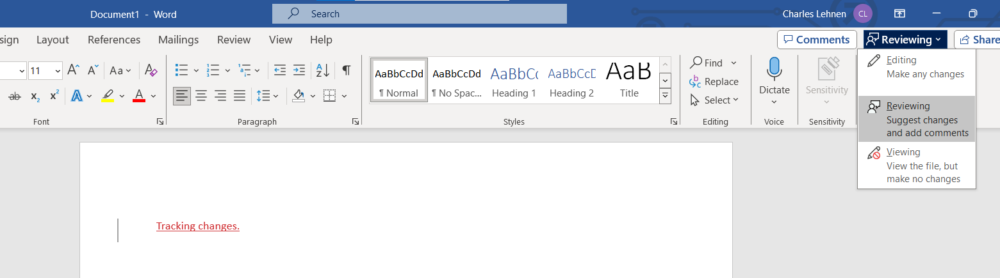{width="470"}

-   **Historical Backup**: You can go back in time and restore previous versions of your project, which allows you to recover lost functionality.

    -   Examples:
        -   Version history in Google Docs
            -   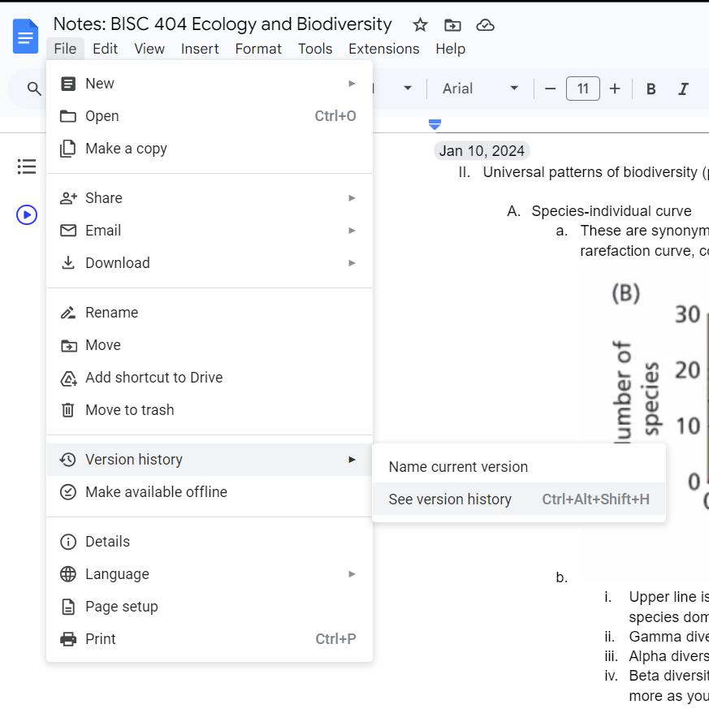{width="317"}
        -   Edit history in individual cells in Google Sheets
            -   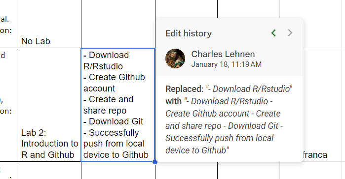{width="315"}
        -   Browsing to previous versions of a document using Github.com
            -   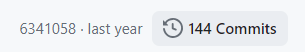{width="197" height="34"}
            -   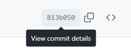{width="179"}
            -   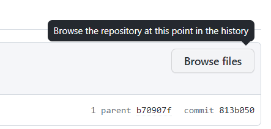{width="212"}

-   **Cloud Backup**: Hosting services like GitHub provide a remote location to store your repositories, ensuring that your work is safe and up to date across devices.

-   **Team Development**: Git allows multiple team members can work on the same files concurrently. Git is designed to handle potential conflicts by providing tools for merging changes made by different developers.

    -   Example: [dplyr Github page](https://github.com/tidyverse/dplyr)

-   **As a Living Resume:**

    -   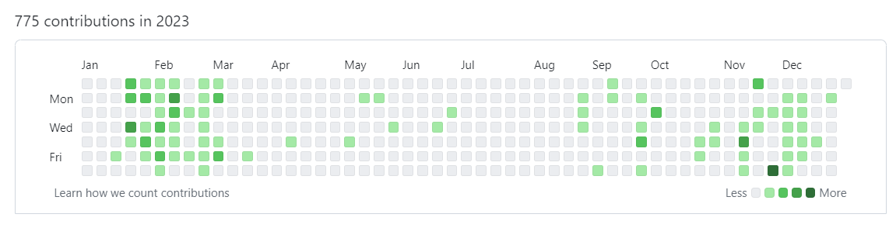

    -   Make sure to make your private repo contributions visible:

        -   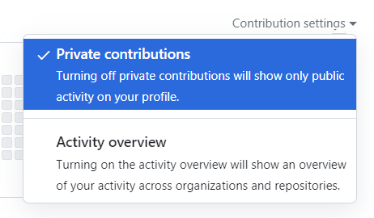{width="232"}

-   **Hosting Project Online:** Share your work with others around the globe in order to contribute to your field, as a living resume of your capabilities, and to gain insight from others on how to improve your work.

    -   Examples:

        -   [QGIS KML to DJI Pilot 2](https://github.com/CharlesLehnen/QGIS_KML_to_DJI_Pilot_2)

        -   [YouTube Trailcam Classification Tool](https://github.com/CharlesLehnen/YouTube_Trailcamera_Livestream_Classification_Tool)

    -   Because of this aspect, intuitive organization is important!

## [Download GitHub Desktop](https://desktop.github.com/download/)

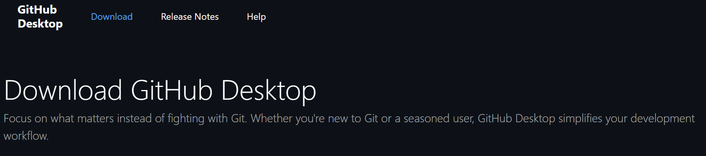

## Git files

Each Git **repository** is like a folder that contains the files specific to an individual project. Understanding the structure of a Git repository is crucial:

-   **.git File**: This hidden folder in your repository contains all version control history.
-   **.gitignore**: A text file that tells Git which files or folders to ignore (not add to stage) in a project.
-   **Licenses**: Choosing a license dictates how others can use, modify, or distribute your code, especially in regards to commercial usage.
-   **README**: A markdown file that introduces and explains a project. It can include instructions on how to use your code, who maintains it, and other relevant information.

## Git Workflow

### Personal Use

The basic Git workflow for personal use involves the following steps:

1.  **Working Directory**: Where you do work on your local device.
2.  **Staging Area**: A file in the .git directory that stores information about what you have chosen to go into your next commit.
3.  **Local Repository**: The .git history on your local device.
4.  **Remote Repository**: The .git history in the cloud that should be synced between devices

{fig-align="center" width="400"}

*Source: [Git & GitHub - Workflow Fundamentals](https://dev.to/mollynem/git-github--workflow-fundamentals-5496)*

These commands are all available through Rstudio:

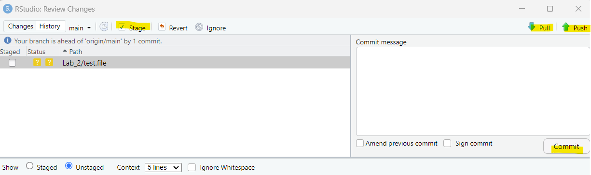{fig-align="center" width="550"}

And through GitHub desktop:

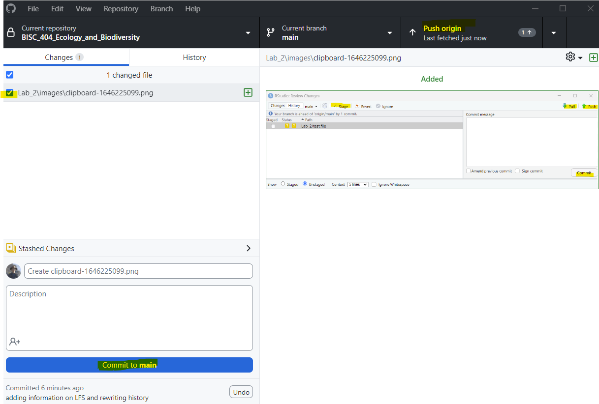{fig-align="center" width="550"}\
\

# Best Practices

## When to Commit Changes

When working with Git, committing changes is like setting a checkpoint in your development process which you can return to if needed. Here are some best practices for *when* to commit your changes:

-   **Logical Changes**: Make a commit when you complete a logical section of work, such as fixing a bug, adding a new function, or improving performance.
-   **Successes**: Commit your changes when your code works. This practice ensures that you are committing a stable version of the code.
-   **End of Work Session**: It's good to commit at the end of a work session. This creates a restore point to which you can return to.
-   **Before New Tasks**: Before switching to a new branch or starting a new task, commit your current changes to keep your work organized.

Avoid committing half-done work that could break functionality. Use Git's "stash" feature or work on a separate branch if you need to switch contexts temporarily.

### Commit Messages

Commit messages should be clear and descriptive. They should explain what was changed and why. If you used a resource, it is good to cite it in the description of your commit. Here are some examples of good commit messages:

\- `git commit -m "Fixed bug causing incorrect output"`

\- `git commit -m "Added new function to calculate average"`

\- `git commit -m "Updated README with instructions"`

## When to Push

Pushing changes to the remote repository should be done regularly to back up your work and keep your collaborators up to date with your progress. Here's when to push:

-   **After a Series of Commits**: Once you've made several commits that constitute a section of work, push these changes to the remote repository.
-   **At the End of your Work Session**: Ensure that your daily progress is saved remotely by pushing your commits at the end of a work session.
-   **Collaborative Work**: If you're working with a team, push your commits often to minimize merge conflicts and keep the remote repository current with everyone's changes.
-   **After Pulling**: Always push your latest commits after pulling new changes to ensure smooth integration of the work.

If working on a shared branch, be considerate about pushing only stable and tested changes to avoid disrupting your teammates' work.

# Activity 1

Take time to better organize the folder/file structure of your repo

-   Here is a template format you can use:

    -   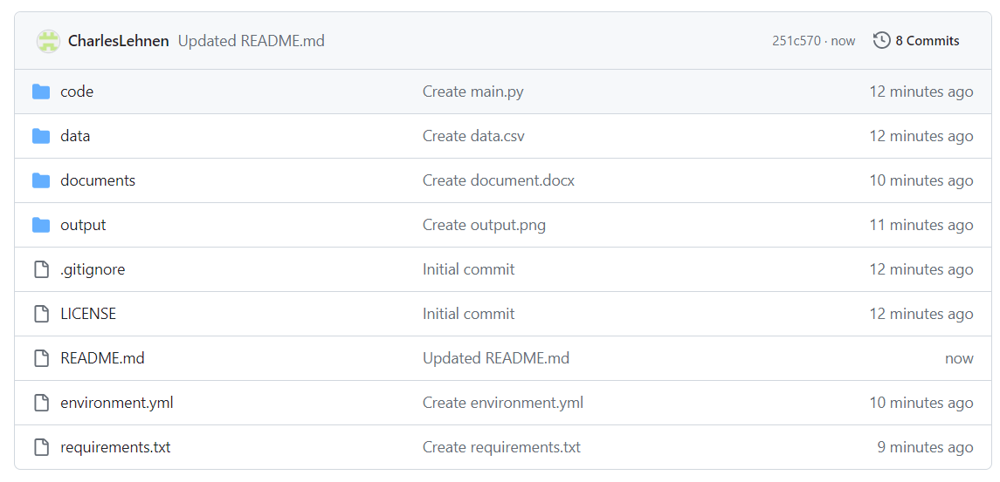{width="264"}

    -   [Template Repository](https://github.com/CharlesLehnen/standard_repository_template)

-   You can also follow a template like this for coursework:

    -   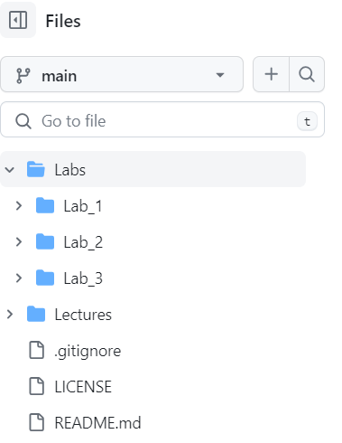{width="162"}

-   Or you can make whatever folder structure makes sense to you, as long as it is intentional and logical

::: callout-warning
## Github Warnings!

-   **Note:** Github does *not* like empty folders

-   GitHub does not do well with large files. Best to add them to `.gitignore` and back them up separately (Google Drive, OneDrive, etc.)
:::

# Activity 2

On your computer add whatever descriptive text you would like to your `README.md` file. You could add a description of your folder structure, you could start a list talking about which topics we covered in which labs, you could start a documents folder and download the course syllabus to it, etc.

For inspiration, you could look at [this README.](https://github.com/CharlesLehnen/standard_repository_template/blob/main/README.md)

Add some style to your README following this guide:\
\
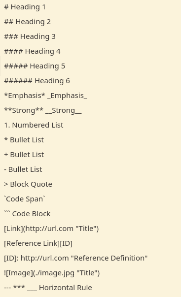\
[*Source*](https://lukegearing.blot.im/using-markdown-and-pandoc-to-make-rpg-documents-for-free)

*To add styles, be sure to be viewing this `.qmd` in "Source" mode.*

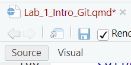

------------------------------------------------------------------------

# Appendix

### Team Use

For team projects, the workflow includes additional steps to facilitate collaboration:

1.  **Forking/Branching**: Creating a personal copy of the main repo.
2.  **Cloning**: Copying a repo to your local machine.
3.  **Committing**: Saving snapshots of your changes in the local repository.
4.  **Pushing**: Sending your committed changes to a remote repository.
5.  **Pull Requests**: Requesting that the project maintainer pulls the changes you've made to the main repo.
6.  **Merging**: The project maintainer reviews and merges your changes into the main project.

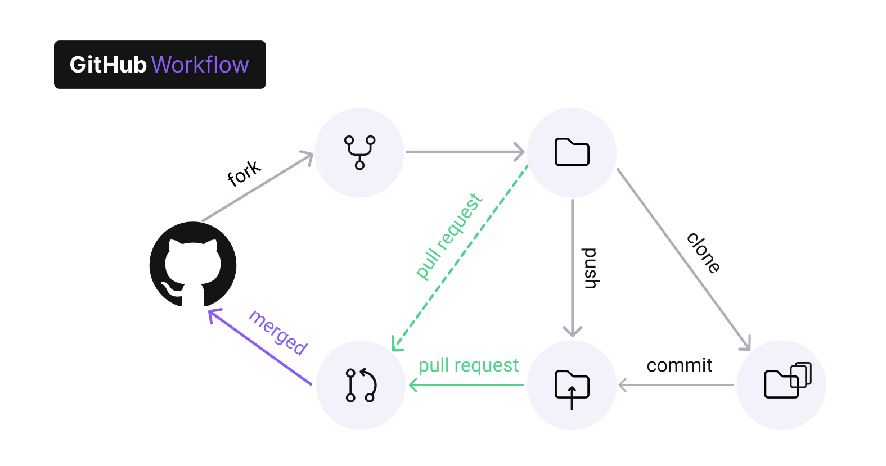{fig-align="center" width="400"}

*Source: [Vulnerable GitHub Actions Workflows Part 1: Privilege Escalation Inside Your CI/CD Pipeline](https://www.legitsecurity.com/blog/github-privilege-escalation-vulnerability)*

## Basic CLI Commands in Git

Here are some common commands used in the command-line interface (CLI) of Git:

-   `git add [file]`: Add a file as it looks now to your next commit (stage).
-   `git commit -m "[descriptive message]"`: Commit your staged content as a new commit snapshot.
-   `git push [alias] [branch]`: Transmit local branch commits to the remote repository branch.
-   `git pull`: Fetch and merge any commits from the tracking remote branch.

:::: callout-note
## Large Files on GitHub

\
You are not able to push files larger than 100mb to GitHub normally. However, **you will not be warned if you commit a file larger than 100mb**. This is another reason to push often, because git will hang and you will get a failure to push error if you try to push a commit containing large files. You should be diligent about file size because commiting large files is a tricky problem to address.\
\
In order to track files larger than 100mb but **smaller than 2gb**, you can use git's Large File System (LFS). Instead of directly storing your files in your repo, it stores files elsewhere and references them in your repo. In order to use LFS, you need to use the command line. After cd'ing to the directory that contains your `,git` directory:\
\
`git install lfs`

`git lfs track <filename or "<dir>/**" >`

`git add .gitattributes`

`git add <filename or dir/>`

`git commit -m “<commit message>”`

`git lfs push --all origin main`

`git push -u origin main`\

You will only need to do this the first time you commit a large file/directory. After that it will continue to be tracked using LFS.

::: callout-warning
## Rewriting History: Overly Large Files in Your git History

If you have not been pushing often enough, you may have ended up with commits in the past that contain files that are too large either for normal pushing (over 100mb) or for LFS (over 2gb). Git recommends a third-party tool to address this called [git-filter-repo](https://github.com/newren/git-filter-repo/blob/main/Documentation/converting-from-filter-branch.md#cheat-sheet-conversion-of-examples-from-the-filter-branch-manpage):

-   Install git-filter repo:

    -   Windows:

        `pip install --user git-filter-repo`

    -   Mac:

        `brew install git-filter-repo`

-   cd to the directory that contains your .git folder

-   Remove the commit history:

    `git filter-repo --invert-paths --path \<filename or dir\>`

    ```{=plaintext}
    -   You may need to do the following:

        `git filter-repo --invert-paths --path \<filename or dir\> --force`
    ```

-   Check to make sure it worked (this should return no result):

    `git log --all -- \<filename or dir\>`

-   Push:

    `git push --force --all`

-   You may have to do this afterwards to reconnect to remote:

    `git remote add origin \<url\>`

    `git push --force --all origin`
:::
::::
