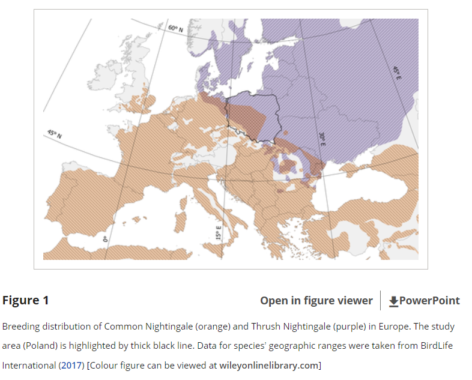
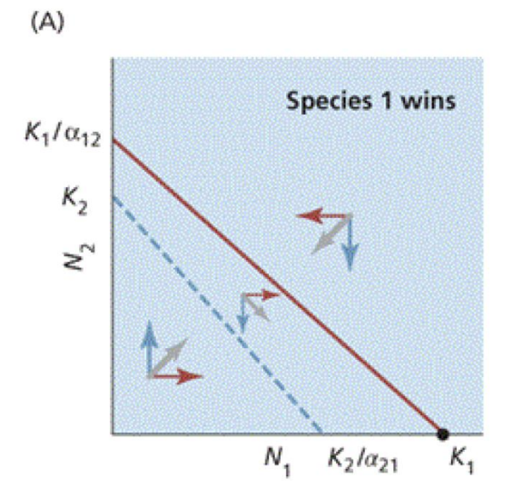

```{r setup, include=FALSE}

rm(list = ls())

library(dplyr)
library(tidyr)
library(ggplot2)
library(deSolve)
library(readr)


```

# Interspecies Interactions: Competition

## Lotka-Volterra Interspecific Continuous Logistic Growth Model

Today we will focus on "Lotka-Volterra Interspecific Continuous Logistic Growth" which is common in nature. Let's break this term into individual parts:

```{=plaintext}
looking at species limiting eac other density continously
```
From lab 3, do you remember what the equation for continuous logistic growth?

\\\$\\\$

rN( 1-N/K )

\\\$\\\$

Why do we use $r$ in this equations instead of $\lambda$?

```{=plaintext}
bc cotinous 
```
Why did we incorporate $K$?

```{=plaintext}
bc logisticbc carrying capicty
```
We can rearrange to help us convert this to relate to interspecific competition:

$$
rN(\frac{K}{K} - \frac{N}{K})
$$

$$
rN(\frac{K-N}{K})
$$

This continuous logistic growth equation is currently for a single species, but our model today should be interspecific. In order to do so, we can add the term $\alpha$ which is the effect of species 2 on the population growth of species 1 (i.e. how many individuals of species 2 are equivalent to one individual of species 1 in regards to resource usage).

$$
\frac{dN_{1}}{dt} = r_{1}N_{1}(\frac{K_{1} - N_{1} - \alpha N_{2}}{K_{1}})
$$

$$
\frac{dN_{1}}{dt} = r\_{1} N\_{1} \left(1 - \frac{N_{1}}{K_{1}} - \frac{\alpha N_{2}}{K_{1}} \right)
$$

We can simplify this equation by integrating carrying capacity $K$ into the term $\alpha_{11}$ representing conspecific/intraspecific density-dependence.

$$
 \alpha_{11} = \frac{1}{K_{1}}
$$

We can also combine terms into interspecific density dependence or "interspecific competition coefficient" $\alpha _{12}$ which can be read as "the impact of species 2 on species 1."

$$
\alpha_{12} = \frac{\alpha}{K_{1}}
$$

For example:

-   If 1 aquatic turtle (species 1) has the same impact on resources as 4 fish (species 2) would, its presence affects species 2 as much as 4 individual fish would. We can write $\alpha_{21}=4.0$

-   Conversely, if the effect of species 2 on species 1 is reciprocal, i.e. one fish has the same resource impact as one-third of a turtle, then $\alpha_{12}=0.25$.

Substituting these in, the result is the "Lotka-Volterra Interspecific Density-dependent Growth" model:

$$
\frac{dN_{1}}{dt} \ =\ r_{1} N_{1} \ ( \ 1\ -\ \alpha _{11} N_{1} \ -\ \alpha _{12} N_{2})
$$

$$
\frac{dN_{2}}{dt} \ =\ r_{2} N_{2} \ ( \ 1\ -\ \alpha _{22} N_{2} \ -\ \alpha _{21} N_{1})
$$

Now let's create a function for this model in R. Once again, we can write differential equations in R using the ordinary differential equation (ODE) package `deSolve`[@deSolve] following the format:

Write a function `interspec_dens_dep_growth` to represent interspecific density-dependent growth (`dn1dt` and `dn2dt`) between 2 species `n[1]` and `n[2]`.

```{r}
interspec_dens_dep_growth <- 
  function(t, n, parms) {
  with(as.list(parms), {
    dn1dt <- r1 * n[1] * (1-a11 * n[1] -a12 * n[2])
    dn2dt <- r1 * n[2] * (1-a22 * n[2] -a21 * n[1])
    list(c(dn1dt, dn2dt))
  })
}


```

Run your function `out <- deSolve::ode(y = c(N0_1, N0_2), times = times, func = interspec_dens_dep_growth, parms = parms)` with the following arguments:

-   Intrinsic rate of growth of species A is 1 and of species B is 0.1.
-   The interspecific negative density dependence of species A on B is 0.1. Vice versa is 0.01.
-   The intraspecific density dependence is 0.2 and 0.02 of species A and B respectively.
-   Initial population sizes of species A and B are 2 and 1 respectively
-   Time range will be 1:100

```{r}

parms <- c(
  r1 = 2,
  r2 = 0.1,
  a11 = 0.0002,
  a22 = 0.02,
  a12 = 0.0003,
  a21 = 0.01
)

times <- c(1:100)

N0_1 <- 2
N0_2 <- 1

out <- deSolve::ode(y = c(N0_1, N0_2), times = times, func = interspec_dens_dep_growth, parms = parms)

out
```

Now plot your results:

*Hint: `ggplot2` doesn't like column names that are numeric, so include* `rename(times = 1, SP1 = 2, SP2 = 3)` in your pipe

```{r}

parms <- c(
  r1 = 2,
  r2 = 0.1,
  a11 = 0.0002,
  a22 = 0.02,
  a12 = 0.0003,
  a21 = 0.01
)zzzzzzzzz
ode_df <- out %>%
  as.data.frame() %>%
  rename(times = 1, SP1 = 2, SP2 = 3)
ggplot(data = ode_df, aes(x = times)) +
  geom_line(aes(y = SP1, color = "species 1")) +
  geom_line(aes(y = SP2, color = "species 2")) +
  labs( x = "Years", y = "Population Size", color = "Species")
  
```

Describe what you observe in the output of this model with the given parameters. How are the populations of species A and B growing/declining? How are they influencing one another?

```{=plaintext}
```
## Instability

By modifying the parameters `a12`, `a21`, `a11`, and `a22`, can you find values where species A goes extinct? Can you find values where species B goes extinct?

```{r}


```

What do you observe?

```{=plaintext}
```
Which types of relationships are these different values reflecting?

-   **Neutralism**: $$ a_{12} = 0, \quad a_{21} = 0 $$
    -   No direct influence of either species on the other. They coexist without interaction.
-   **Amensalism**: $$ a_{12} < 0, \quad a_{21} = 0 $$
    -   One species is negatively affected while the other remains unaffected.
-   **Commensalism**: $$ a_{12} > 0, \quad a_{21} = 0 $$
    -   One species benefits without impacting the other (e.g., species 1 benefits while species 2 is unaffected).
-   **Competition**: $$ a_{12} < 0, \quad a_{21} < 0 $$
    -   Both species negatively impact each other, leading to a struggle for resources.
-   **Antagonism**: $$ a_{12} < 0, \quad a_{21} > 0 $$
    -   One species benefits at the expense of the other (e.g., predator-prey, host-parasite, consumer-resource interactions).
-   **Mutualism**: $$ a_{12} > 0, \quad a_{21} > 0 $$
    -   Both species benefit from their interaction (e.g., symbiosis, cooperative relationships).

## Neutral Equilibria

Set your parameters to the following conditions:

``` r
r1 <- r2 <- 1
a11 <- a21 <- 0.01
a22 <- a12 <- 0.015
N0_1 <- 2
N0_2 <- 1
```

```{r}


```

What do you observe? Is this result stable or unstable? Or something more nuanced? Explain. *Hint: Try varying the initial population sizes and observe what happens.*

```{=plaintext}
 
```

------------------------------------------------------------------------

# Interspecific Continuous Logistic Growth With Real Data

From year 2000 to 2014, Reif et al. 2019[@reif2018competition] collected nightingale (n=552) distribution data from 959 plots, focusing on sibling species Common Nightingale (*Luscinia megarhynchos*) and the Thrush Nightingale (*L. luscinia*). This study was conducted in Poland where these species overlap in range:

{fig-align="center"}

Along with population counts, researchers noted the following relationships:

-   **Allopatric:** Two or more related species which have separate distributions geographically.

-   **Sympatric:** Two or more related species which have the same or overlapping distributions geographically.

    -   **Syntopic:** Two or more related species which have the same or overlapping distributions geographically, and share the same habitats within that distribution

    -   **Allotopic:** Two or more related species which have the same or overlapping distributions geographically, but do not share the same habitats within that distribution

Let's load in the `nightingales.csv` data and assign to the variable `nightingales_raw`. *(Hint: if you are having trouble loading the data, view the file in Rstudio. You may need to use the `read_delim()` function and define the `delim` paramater in your data loading function)* Briefly explore the dataset:

```{r}
library(readr)

nightingales_raw <- read.csv("lab_5_data/nightingales.csv", sep = ",")

nightingales_raw

library(readr)

nightingales_raw <- read.delim("lab_5_data/nightingales.csv", delim = ",")

nightingales_raw


```

Clean the data using the `separate()` function from the `tidyr`[@tidyr] package to separate `species` and `co_occurence_status`. Assign to variable `nightingales_disag` as it is best practice to keep the raw data intact as its own variable.

```{r}

# Cleaning data


```

To help us visualize our dataset, let's map our data and facet by `co_occurence_status`. We can make a simple map using `ggplot2`.

We can add the `facet_wrap()` function to our `ggplot()` workflow to rapidly generate plots for all orders at once following this format:

``` r
facet_wrap(~ <categorical variable>, scales = <>)
```

The `scales` parameter can be used to determine if y-axes should be independent (`free_y`), x-axes should be independent (`free_x`), or if all axes should be independent (`free`) between all plots. The default is `fixed`. Which of these do you think would be the best in t543his case?

```{r}


```

Because we are more interested in inter-year trends than intra-year trends, let's aggregate our data by year:

```{r}

nightingales_agg <- nightingales_raw %>%
  separate(col = co.occ, into = c("species", "co_occurrence_status"), sep = "\\.") %>%
  group_by(species, year, co_occurrence_status) %>%
  summarize(avg_count = mean(count), .groups = "drop") %>%
  ungroup()

# We are using summarize() instead of mutate because summarize() will make the group_by() permanent and make the `avg_count` permanent. If we used mutate() in this case, the column created would disappear.

# Note that it is good practice to use `.groups = "drop"` with `summarize()` because it can cause lasting, unintentional grouping like `group_by()` does.

nightingales_agg

```

Inspect the dimensions, do they make sense?

```{=plain}
```
Now plot `avg_count` across time for `nightingales_agg` using `geom_point()` and `geom_smooth`, faceted by `co_occurrence_status`

```{r}


```

It looks like there might be a difference between co-occurrence statuses. Let's see if competition is occurring. In order to do so we will need to extract the following parameters from our data:

-   r1 = Intrinsic rate of growth of species CN
-   r2 = Intrinsic rate of growth of species TN
-   a21 = The interspecific negative density dependence of species CN on TN
-   a12 = The interspecific negative density dependence of species TN on CN
-   a11 = The intraspecific density dependence of species CN
-   a22 = The intraspecific density dependence of species TN
-   N0 = Initial population sizes of each species
-   times = Time range of dataset in years

### Time Range

```{r}

min_time <- min(nightingales_agg$year)
max_time <- max(nightingales_agg$year)

times <- c(1:(max_time - min_time + 1))

times

```

### Initial Population Sizes

```{r}

# I am going to assume I can just average across the different groups to calculate N0

N0_CN <- nightingales_agg %>%
  filter(species == "CN") %>%
  summarize(N0 = mean(avg_count[year == min(year)]), .groups = "drop") %>%
  pull(N0)

N0_CN

# If your dataset has one value for the first time point, you would not need to average:
# N0_CN <- nightingales_agg %>%
#   arrange(year) %>%
#   summarize(N0 = first(avg_count), .groups = "drop") %>%
#   pull(N0)


# Now repeat for TN


```

### Intrinsic Population Growth Rates

A simplified estimation of intrinsic population growth is to calculate the average value of intrinsic growth rate within a given interval:

$$
r = \frac{log(\frac{\bar N_{t_{final}}}{\bar N_{0}})}{t_{final}-{t}}
$$

```{r}

# Just like we have done inside of apply() family functions, ggplot2(), and ode(), we can write functions inside of summarize() 

r1 <- nightingales_agg %>%
  arrange(species, year) %>%
  filter(co_occurrence_status == "alop", species == "CN") %>%
  summarize(r = log(last(avg_count) / first(avg_count)) / (last(year) - first(year))) %>%
  pull(r)


# Now repeat for r2


```

Let's plot to check to see if this is a decent approximation.

How do we plot intrinsic growth rate?

Let's go back to our population growth lab! How did we model continuous exponential population growth?

$$
Ne^{rt}
$$

```{r}

Nt_CN <- N0_CN * exp(r1 * times)

Nt_CN_df <- data.frame(
  year = min_time + times - 1,  # Convert 'times' back to actual year values
  Population = Nt_CN,
  species = "CN" # This will just help the ggplot legends sync up between our datasets
)

```

```{r}

Nt_TN <- N0_TN * exp(r2 * times)

Nt_TN_df <- data.frame(
  year = min_time + times - 1, 
  Population = Nt_TN,
  species = "TN"
)

```

```{r}

nightingales_agg %>%
  filter(co_occurrence_status == "alop") %>%
  ggplot(aes(x = year, y = avg_count, color = species)) +
  geom_point() +
  geom_line(data = Nt_CN_df, aes(x = year, y = Population, color = species)) +
  geom_line(data = Nt_TN_df, aes(x = year, y = Population, color = species)) +
  labs(title = "Population Size", x = "Year", y = "Population Size")


```

Although not an excellent fit, for the purpose of this course we will assume these are good enough for our oversimplified analyses.

### Intraspecific Density Dependencies

For intraspecific density dependencies ($a_{11}$ and $a_{22}$), what do you think a good estimate would be?

Back to population growth lab: density-dependent growth!

$$
rN(1-\frac{N}{K}) 
$$

For this lab, we will just assumed carrying capacity is the maximum size of each population.

```{r}

K_CN <- nightingales_agg %>%
  filter(species == "CN") %>%
  summarize(K = max(avg_count), .groups = "drop") %>%
  pull(K)

K_CN

# Now repeat for TN


```

We can use one of the [first equations](https://en.wikipedia.org/wiki/Pierre_Fran%C3%A7ois_Verhulst) ever used to express logistic growth to calculate our intraspecific competition terms:

$$
\alpha = \frac{r}{K}
$$

```{r}


r1 <- 1
K1 <- 5

r2 <- 0.1
K2 <- 5

alpha1 <- r1 / K1
alpha2 <- r2 / K2

alpha1
alpha2
```

## Interspecific Negative Density Dependencies

As a very simplistic way to estimate interspecific negative density dependencies if you do not have allopatric vs. sympatric data, you can still calculate $a_{12}$ and $a_{21}$ like we did in lecture, by taking the mean population size of each species and dividing them by one another:

$$
a_{12} = \frac{\bar N_{2}}{\bar N_{1}}
$$

```{r}


```

Remember the above assumes that each species has a reciprocal effect on the other, which may not be the case in nature.

### Lotka-Voltera Interspecific Competition Model

Now let's input our values into our Lotka-Voltera interspecific competition model:

```{r}

interspec_dens_dep_growth <- function(t, n, parms) {
  with(as.list(parms), {
    dn1dt <- r1 * n[1] * (1 - a11 * n[1] - a12 * n[2])
    dn2dt <- r2 * n[2] * (1 - a22 * n[2] - a21 * n[1])
    list(c(dn1dt, dn2dt))
  })
}

```

Set parameters:

```{r}

# Set parameters


# Set N0


# Set times


```

Run the model while adding the parameter `maxsteps = 1e3`:

```{r, warning=FALSE, message=FALSE, results='hide'}

# Run the ODE model


```

Plot your results:

```{r, warning=FALSE, message=FALSE, results='hide'}

# Convert to dataframe for plotting (remember `ggplot()` doesn't like numbers as column names)

  
# Plot the results


```

In general, are these species suppressing the populations of one another? Is competition occurring?

```{=plaintext}
```
Modify the parameters to see if the models agrees with your expectations:

```{r, warning=FALSE, message=FALSE, results='hide'}

# Run with one species absent

# Set N0


# Convert to dataframe for plotting


# Plot the results


```

```{r, warning=FALSE, message=FALSE, results='hide'}

# Run with the other species absent

# Set N0


# Run the ODE model


# Convert to dataframe for plotting


# Plot the results


```

What do you observe?

```{=plaintext}
```
What if we run our model for 5000 years, what do you observe?

```{r}

# Set times


# Set N0


# Run the ODE model


# Convert to dataframe for plotting


# Plot the results


```

What do you observe?

```{=plaintext}
```
## Zero Growth Isoclines

To construct the Lotka–Volterra competition isoclines, we first estimate each species’ carrying capacity using the maximum observed average abundance:

$$
K_{CN} = \max(\text{avg\_count of CN})
$$

$$
K_{TN} = \max(\text{avg\_count of TN})
$$

These values approximate the carrying capacities of Common Nightingale (CN) and Thrush Nightingale (TN), respectively.

------------------------------------------------------------------------

Using the Lotka–Volterra competition model, the zero-growth isocline for each species is defined as:

For Common Nightingale:

$$
N_{CN} + a_{12} N_{TN} = K_{CN}
$$

Rearranging to express the line in intercept form:

$$
N_{TN} = \frac{K_{CN}}{a_{12}} - \frac{1}{a_{12}} N_{CN}
$$

This gives two intercepts: - x-intercept: $K_{CN}$ - y-intercept: $\frac{K_{CN}}{a_{12}}$

------------------------------------------------------------------------

For Thrush Nightingale:

$$
N_{TN} + a_{21} N_{CN} = K_{TN}
$$

Rearranging:

$$
N_{TN} = K_{TN} - a_{21} N_{CN}
$$

Or in intercept form:

$$
N_{CN} = \frac{K_{TN}}{a_{21}}
$$

This gives two intercepts: - y-intercept: $K_{TN}$ - x-intercept: $\frac{K_{TN}}{a_{21}}$

{fig-align="center"}

```{r}


```

From this model, which species do you think is the dominant competitor? Do you think there is an equilibrium point?

```{=plaintext}
```

------------------------------------------------------------------------

# References
