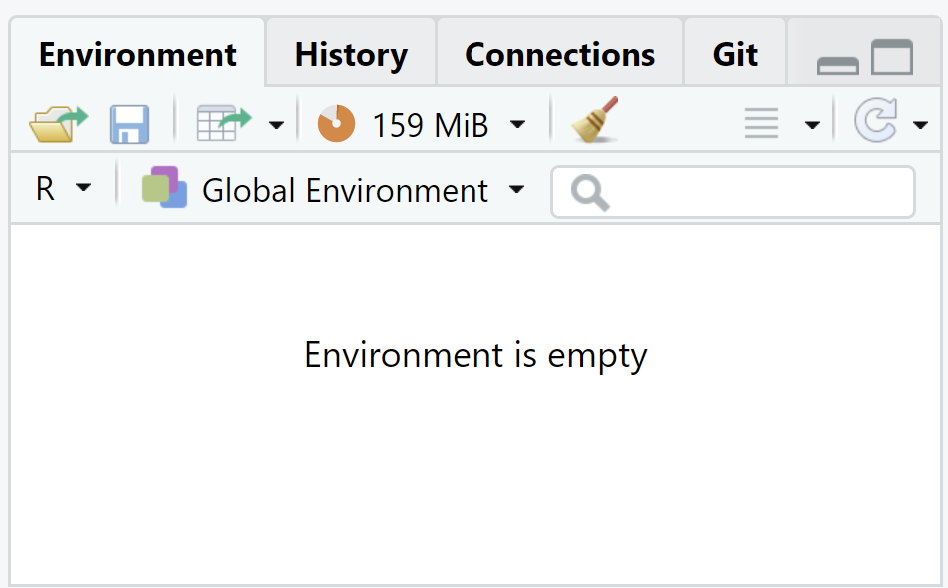
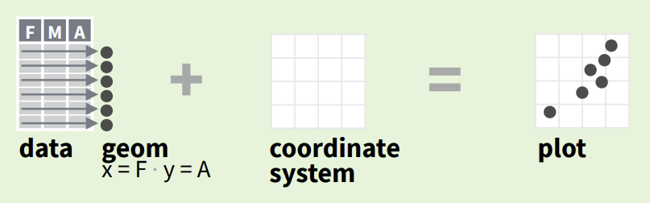
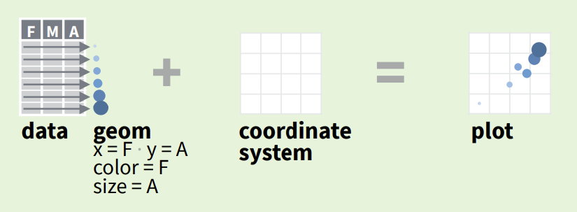
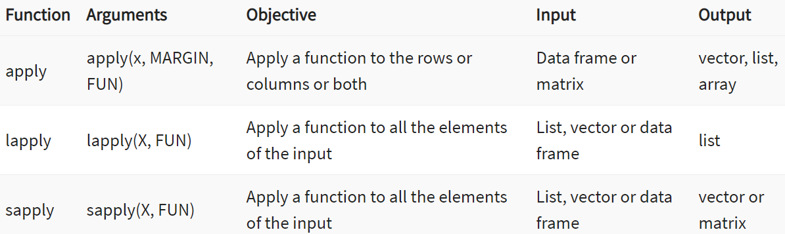

# Introduction to R/Rstudio

```{=html}
<div style="text-align:center;">
  
  
  
</div>
```

To improve on the S language by addressing its lack of open-source access and flexibility for extensions, R was created in 1993 by Ross Ihaka and Robert Gentleman. It is specifically designed from the ground up for statistical analysis.

Unlike compiled languages like C or Java, where code is translated into machine code before running, R is interpreted, meaning it executes code line by line in real time. This allows for interactive experimentation which is a key advantage for statistical analysis.

Vectors were chosen as R's most basic data unit because they allow efficient handling of multiple values simultaneously, aligning with the needs of statistical computations that often involve entire datasets at once.

While Python is widely used for machine learning and general-purpose programming, and Julia offers high-performance numerical computing (calculations on massive datasets), R excels in advanced statistical modeling and data visualization, making it a top choice for many researchers. Since its creation in 1993, R has grown from a niche tool for statisticians to one of the most widely used programming languages in data science, consistently ranking among the top languages for analytics and visualization.

# Review of Data Types

As in most programming languages, data in R can be stored as different data types. Each data type has different attributes, this makes these data types most useful for specific use cases.

It is important to use the correct data type for the associated use case. Therefore, it is important to understand the data types of a given programming language as the foundation to successfully using that language.

In R, we can check the data type of a given input with the `class()` function.

## Booleans

**Booleans** are binary, they can be true or false. They can have the values of `TRUE`/`T`/`1` or `FALSE`/`F`/`0`.

```{r}

class(TRUE)
```

\#

::: callout-caution
## Boolean Values Must be Capitalized

```{r}
#| error: true
class(TRUE)
class(as.logical(1))
```
:::

slashes equal searching

adding hashtags allows comments

::: callout-note
## Explicit Programming

In programming, it is usually preferred to be explicit than implicit. If you can write a value, variable name, column title, function name, etc. in a clear way over an abbreviated way, as an explicit programmer it is better to take an extra second and choose the clear way.

In this case, it would generally be better to use `TRUE` over `T` as an explicit programmer.

Following the principles of explicit programming, it is important to annotate your code with comments, which can be inserted using the `#` symbol in R and/or the `Ctrl+Shift+C` keyboard shortcut in Rstudio/Posit. In your annotated code, comments should be clear enough for another user to understand your code without you explaining it to them.\
\
Keep explicit programming principles in mind throughout this course and your career.
:::

## Numerics

Non-complex numbers are referred to by the class **numeric** in R. They can have the datatype (or subclass) of *1)* *double*, *2)* *integer*.

### Doubles

In R, a **double** is a floating point number. Therefore they can have a decimal point. These numbers can be positive or negative.

Unlike some other programming languages, in R double is always the default data type of a number. Because doubles are the default value of the class numeric, the `class()` of a double will be shown as numeric. However, using the `typeof()` function we can see that these numerics are indeed double by default in R.

```{r}
class(2)

```

```{r}
typeof(2)
a<-2.65
typeof(a)
a
```

::: callout-warning
## Numerics: Trailing Zeros

Unlike many other programming languages, doubles do not automatically display trailing zeros. This can make it a bit more challenging for the user to keep track of what is a double and what is an integer. In reality though, by default in R a number will have two trailing zeros (hence the name "double") in storage even if these zeros are not displayed,

```{r}
a <- 2.00
typeof(a)
a
```
:::

### Integers

Integers are whole numbers. They *1)* cannot have a decimal point and *2)* can be positive or negative.

To specify an integer, include an `L` following the number.

2 == 2.00

2L == 2

```{r}

class(2L)

test_integer <- 2L

test_integer
a
```

::: callout-tip
## In R, integers are numerics, but numerics are not necessarily integers. That is because numerics can also be doubles.

```{r}
is.integer(2L)
is.numeric(2L)

is.integer(2.0)
is.numeric(2.0)
is.double(2.0)
```
:::

## Strings

**Strings** are how you represent text in R. Note that numbers can indeed be represented in text form.

```{r}

class("two")

class("2")

rm(a)

a <- 2.00

# to remove just say rm ().
```

## Other Data Types

There are other data types in R (**single**,**complex**, **raw**), however we will not cover these at this time.

------------------------------------------------------------------------

# Data Structures in R

## Vectors

Each of the above examples involves a single number or string. We can assign these to an **object name**.

```{r}
scalar_1 <-3
scalar_1
# cant include spaces of caps for scalar
```

::: callout-note
## Object Name Assignment Requirements and Convention

\
Note that in R object names are *1)* case-sensitive and *2)* cannot include spaces

It is convention in R as well as many other programming languages to begin mutable object names with a lower-case letter
:::

::: callout-tip
## Vectors and Scalars in R

Note that unlike many other programming languages, technically even scalars are actually vectors in R. Under the hood, `c(1)` and `1` are both identical in R, they are both stored and treated as `c(1)`.
:::

We can combine multiple scalars into a **vector** data structure. Vectors are

-   1-dimensional

-   Contain *only one* data type

```{r}

scalar_2 <-2
vector_1 <- c(scalar_1, scalar_2)
vector_1
```

```{r}


```

::: callout-tip
## Automatic Coercion: Vectors vs. Lists

Note that because vectors can only contain one data type, if more than one data type is present they will all be automatically coerced to the same data type using the following hierarchy.

$$
character\ \leftarrow \ double\ \leftarrow \ integer\ \leftarrow \ logical
$$

```{r}
vector_1 <- c(scalar_1, scalar_2, "1")
vector_1

class(scalar_1)

vector_1 <- c(scalar_1, scalar_2, TRUE)
vector_1
```

In order to avoid this automatic coercion, you can use the data structure **list** in R

```{r}
list_a <- list(scalar_1, scalar_2, "1")
list_a

class(list_a)
```

```{r}
list_b <- list(scalar_1, scalar_2, TRUE)
list_b

class(list_b)
```
:::

## Matrices

The data structure **matrices** in R are similar to vectors and also can only contain a single data type. However, matrices are *2-dimensional*. If you construct a matrix from vectors, you can think of vectors like *columns* in a matrix.

Matrices can be constructed using the `matrix()` method.

::: callout-important
## Caution:

1.  Every row in a matrix must have the same number of columns

2.  Every column in a matrix must have the same number of rows
:::

```{r}
vector_2 <- c(6,5,4)

 ncol = 2)

matrix_1
```

```{r}

```

::: callout-note
## Arrays in R

Note that an \*\*array\*\* in R is similar to a matrix but can be comprised of any number of dimensions more than 1, whereas a matrix is comprised of exactly 2 dimensions.
:::

Matrices can also be constructed using the `cbind()` and/or `rbind()` methods.

```{r}

matrix_1 <- cbind(vector_2, vector_1)

matrix_1

#this is a easier way to make a matrix
```

```{r}

matrix_1 <- rbind(vector_2, vector_1)

matrix_1
```

Matrices can be subset

```{r}

matrix_1[2,1]

# just says go to roy 2 colum 1 and grab the number
```

::: callout-tip
## Subsetting in R

Note that subsetting in R begins at 1, not 0. This may be different than other programming languages you are used to.
:::

::: callout-warning
## Automatic Coercion: Matrices

Similar to vectors, data types are also coerced in matrices

```{r}
vector_3 <- c("Monday","Tuesday","Wednesday")

matrix_2 <- cbind(vector_2, vector_1, vector_3)

matrix_2
```
:::

## Data Frames

**Data frames** in R are similar to matrices in that they are 2-dimensional. However there is one major difference, data frames can contain scalars of multiple data types. Because of this attribute to the data frame class, you can use them in the same applications you would use a spreadsheet normally.

In R, you may think of it like: lists are to vectors as data frames are to matrices.

```{r}
vector_1 <- c(3,2,3)
df_for_testing_dataframes <- data.frame(column_1 = vector_2, column_2 = vector_1, column_3 = vector_3)

df_for_testing_dataframes
```

Just like matrices, data frames can be subset. Note that we avoided coercion with a data frame.

```{r}

df_for_testing_dataframes [2,3]

```

You can select rows using subsetting

```{r}
subset(df_for_testing_dataframes, column_3 == "Wednesday")

```

```{r}


```

We will also learn other, more intuitive methods for subsetting using the package `dplyr` later in this lab.

## Other Data Structures in R

There are other data structures in R that we will not cover at this time like **factors**, which are used for categorical variables.

Here is a powerful cheatsheet for base R functionality:

```{=html}
<iframe src="../images/ggplot2_cheatsheet.pdf" style="width:50%; width:50vw; width:50dvw; height:100%; height:100vh; height:100dvh;"></iframe>
```

------------------------------------------------------------------------

# Functions

Functions are actions on an input. They generally produce an output. We have already been using them above, like `class()`, `matrix()`, `list()`, and `subset()`.

::: callout-note
## Object-Oriented Programming

R is an object-oriented language because everything in R is an **object**.

By definition in programming, an object is an instance of a class. Classes have certain attributes/properties and specific functions, which are referred to as **methods**. When an object is created in your code, that object inherits the attributes of the class you assigned it to. These attributes also serve as built-in parameters for the associated methods.\
\
There are also subclasses (child classes) and superclasses (parent classes). If the object you create is a member of subclass, it will inherit all attributes of its class as well as its parent classes.

**Object-oriented** programming is desirable over **procedural programming** because it is an efficient, non-redundant way to organize and assign attributes to data. Through object-oriented programming you do not have to assign attributes over and over again each time you initialize an object.
:::

<details>

<summary>Additionally, by using inheritance the same method can operate differently on an object depending on its specific subclass or superclass which increase readability and reduces complexity. For example:</summary>

```{r}
summary(1:10)
```

```{r}
summary(df_for_testing_dataframes)
```

</details>

Whenever possible in your programming career, it is generally better to write code following object-oriented principles over procedural programming principles.

## Writing Your Own Basic Functions

Functions must be **defined** before they can be **called**. In R, the definition of a function allows you to:

1.  Name the function

2.  List the required inputs as **parameters**

3.  Define what the function does\

The basic format for writing a function is R is:

```{r}
Function_Name <- function(parameter1, parameter2) {
  c(parameter1, parameter2)
}
```

<details>

<summary>Run the above code chunk, what seems to happen?</summary>

When we defined the function, nothing seemed to happen. That is because we must call the function in order to run it.

</details>

In order to call the function, we must provide the required parameters as **arguments**.

```{r}

Function_Name("argument1", "argument2")
```

<details>

<summary>

Now it is your turn! Write a function called `Calculate_Mean()` that calculates the mean of vector `c(1,2,3,4)` using the `sum()` and `length()` functions within your function definition.

Note, if you want to check what a function does in R, you can use the `help()` function or the `?`. For example `help(length)` or `?length()`.

</summary>

```{r}

vector_1 <- c(1,2,3,4)

Calculate_Mean <- function(vector) {
  sum(vector) / length (vector)
}

Calculate_Mean(vector_1)
mean(2.5)
```

</details>

Functions can also contain default values for parameters following the format:

```{r}

Function_Name <- function(parameter1, parameter2 = "default") {
  c(parameter1, parameter2)
}

Function_Name("argument1")
```

These default values can be overwritten by the provided arguments

```{r}

Function_Name("argument1", "argument2")
```

<details>

<summary>Write a function that divides each element of vector `c(1,2,3,4)` by two using a default parameter value of 2.</summary>

```{r}
vector_1 <- c(3,2,3)
adding_2 <- function(vector_1, x=2) {vector_1 + 2}

adding_2(vector_1)

adding_2(vecor_1, 3)
# override your two by putting another parameter (aka 3 down below)
```

</details>

<details>

<summary>Now call the same function again without modifying the function itself, but divide each element by 3</summary>

```{r}
Divide_by_Two(vector_1, 3)
```

</details>

### Function Returns

Note what happens by default when we assign the results of function to a new object inside of a function:

```{r}
#| error: true

vector_1 <- c(1,2,3,4)

Divide_by_Two <- function(vector, denominator = 2) {
  vector_4 <- vector / denominator
}

Divide_by_Two(vector_1)
vector_4
```

The new object `vector_4` is not found outside of the function. This is happening because objects, datasets, and even other functions inside of a function are kept within their own environment.

The base environment is referred to as the "global environment." The contents of this global environment is displayed in the upper-righthand of Rstudio. We can check that `vector_2` is not in the global environment by checking that it is not found in the environment pane. So how do we pass this object from inside the function into the global environment?

R gives you a few options and tries to make this easy for you. Let's start by clearing the global environment with `rm(list=ls())`.

```{r}

# should always start with this when creating a new r to clear
rm(list=ls()) 
```

Now you can see that the environment pane is empty.

{fig-align="center" width="400"}

<details>

<summary>Likely the most straightforward way in R to assign the value produced by a function is to assign the value to an object in the global environment when the function is called:</summary>

```{r}
vector_1 <- c(1,2,3,4)

Divide_by_Two <- function(vector, denominator = 2) {
  vector / denominator
}

vector_4 <- Divide_by_Two(vector_1)
vector_4
```

</details>

::: callout-warning
## Super Assignment in R

<details>

<summary>Another method you may see, but should avoid, is making a global assignment with the "super assignment operator" or "global assignment operator" `<<-`. Even if an assignment is made inside of a function, this assignment will pass the object globally.</summary>

```{r}
rm(list=ls()) 

vector_1 <- c(1,2,3,4)

Divide_by_Two <- function(vector, denominator = 2) {
  vector_4 <<- vector / denominator
}
# dont do the double arrow thingy because rerunning it will give another answer each time because it going off the previous answer
Divide_by_Two(vector_1)
vector_4
```

</details>

<details>

<summary>This method is dangerous because if the function is run more than once, the object can unintentionally be reassigned each time</summary>

```{r}

Divide_by_Two <- function(vector, denominator = 2) {
  vector_4 <<- vector / denominator
}

vector_4 <- Divide_by_Two(vector_4)
vector_4

vector_4 <- Divide_by_Two(vector_4)
vector_4

vector_4 <- Divide_by_Two(vector_4)
vector_4
```

</details>
:::

::: callout-important
## Explicit Return Statements

<details>

<summary>As you saw above, unlike some other programming language, R does not require you to explicitly include return statements in order to return values from a function. However, you can still explicitly return values with the `return()` statement.\
\
This is more in-line with explicit programming principles and can allow you to be certain which values are returned instead of allowing R to automatically make this choice for you.</summary>

```{r}
rm(list=ls()) 

vector_1 <- c(1,2,3,4)

Divide_by_Two <- function(vector, denominator = 2) {
  vector_4 <- vector / denominator
  return(vector_4)
}

vector_4 <- Divide_by_Two(vector_1)
vector_4
```

</details>

<details>

<summary>As a side note, you may also these return statements structured without the `return()` function in R, as another attempt of R to make returns more automatic</summary>

```{r}

Divide_by_Two <- function(vector, denominator = 2) {
  vector_4 <- vector / denominator
  vector_4
}

```

</details>
:::

------------------------------------------------------------------------

::: callout-tip
## Packages in R

Libraries in R are called **packages**. These packages contain a suite of specific functions and classes. For example, we will be using the `dplyr`[@dplyr] package in R in this course to wrangle data frames and the `ggplot2`[@ggplot2] package for visualizing plots.

To install packages, use the following commands:

```{r eval=FALSE}

install.packages("dplyr")
install.packages("ggplot2")

# Note that "packages" is plural and that the package name is in quotes

```

Now these packages are installed across R workspaces on your device. However, when you begin your session, you must load your packages into your current workspace.

```{r}

require("dplyr")
library("ggplot2")

```

Note that you may see `require()` used in place of `library()`. Both of these commands will load the package into your workspace. However, `library()` produces an error while `require()` provides just a warning. An error will stop the R script while a warning will not.
:::

------------------------------------------------------------------------

The most intuitive way to wrangle data in R is by using the `dplyr` [@dplyr-2] package which is included in the `tidyverse` [@tidyverse] set of packages.

::: callout-tip
## Data-wrangling and the Grammar of Data Manipulation

The grammar of data manipulation is a set of principles and concepts that provide a consistent approach to thinking about data manipulation. It is based on the idea that there are a only small number of fundamental operations in data manipulation, primarily of which are:

1.  **Filter**: Filtering a subset of rows based on a criteria.

2.  **Select**: Selecting which columns to include in the output.

3.  **Mutate**: Creating new columns or modifying existing ones, usually by manipulating the data in existing columns.

4.  **Summarize**: Aggregating data by groups. For example, calculating the mean of a measurement for a certain group.

The `dplyr` package uses this grammar of data manipulation for data-wrangling in R:

```{=html}
<iframe src="../images/data-wrangling-cheatsheet.pdf" style="width:50%; width:50vw; width:50dvw; height:100%; height:100vh; height:100dvh;"></iframe>
```

As a `tidyverse` package, this wrangling can be accomplished in a streamlined fashion using `tidyverse` pipes `%>%`. These were originally introduced in the `maggritr` [@magrittr] `tidyverse` package but has now been incorporated into other packages as well, like `dplyr`. To learn how to use pipes, let's first wrangle data without pipes.

```{r}

# Construct a simple dataframe

df <- data.frame(column1 = c(1, -2, 3, 7, 33, 1, 4),
                 column2 = c(4, 5, 6, 22, 44, 1, 4),
                 column3 = c(7, 8, 9, 22, 50, 1, 3))


df
```

Here we wrangle the data using `dplyr` without pipes

```{r}

# Filter for only rows in `column1` containing positive numbers
df_base <- filter(df, column1 > 0)
# Select only the second and third column
df_base <- dply::select(df_base,column2, column2, column3)
# Create another column that has elements that are the sum of columns 2 and 3
df_base <- mutate(df_base, column4 = df_base$column2 + df_base$column3)
df_base

```

Here is the basic format of `tidyverse` pipes in R:

``` r
df_out <- df_in %>%
  function(<column_name>) %>%
  function(<row_name>)
```

Note that the assignment only happens once. Also note that the input object, in this case `df_in` generally needs to only be provided once. It is implied to be inserted as the first term of the function by the pipe. Therefore following a pipe, these are equivalent: `function(df, df$<column_name>)` $<=>$ `function(df, <column_name>)` $<=>$ `function(., <column_name>)` $<=>$ `function(<column_name>)`

``` r
function(<column_name>)
```

Compare this to the example above.

Now, rewrite the data-wrangling process above using pipes to create object `df_tidyverse` from `df`

```{r}

df_tidyverse <- df %>%
  filter(column1 > 0) %>%
  select(column2, column3) %>%
  mutate(column4 = column2 + column3)

df_tidyverse
```
:::

::: callout-tip
## Grammar of Graphics in R

Just like we covered the Grammar of Data Manipulation last week when we introduced the `dplyr` package [@dplyr], plots can also be de-composed into grammatical elements [@wilkinson2012grammar] to help intuitively build plots from three primary components:

1.  Data

2.  **Geoms**: Geometric options

3.  Coordinate system (default Cartesian)

{fig-align="center" width="400"}

Variables in the dataset can be mapped to one another using mapping aesthetics (`aes()`) . For example, default mapping `aes(x = variable_1, y = y_variable_2)` maps the first variable to x-axis and second variable to the y-axis.

{fig-align="center" width="400"}

Other common mappings include:

-   **`color`**: assigns a color to each category

-   **`size`**: scales the size of points or lines based on numeric variable

-   **`shape`**: assigns a shape to each category

-   **`fill`**: fills the interior of points or shapes based on categorical variable

\
Similar to the `` `%>% `` pipe operator in `dplyr`, `ggplot` components are added to one another sequentially with `+`

``` r
# Create a ggplot object from the data 
ggplot(data = df, aes(<mapping> = <variable_1>, <mapping> = <variable_2>)) +
  # Create a geometric object
  geom_<type>() +
  # Add labels
  labs(title = "Title", x = "X-axis", y = "Y-axis")
  
```

Now try with our dataset `df_tidyverse`. Create a scatter plot of `column2` vs `column3` with the size of the points scaled by `column4`. Add a title and label the axes.

```{r}


```

With these intuitive lines of code, we are able to generate a useful plot. What do you think the plot might be indicating?

Now change `column4` to be represented by color instead of size. This is easily altered using `ggplot2`.

```{r}


```

This guide will help you to further customize your plots using `ggplot2` including the other common components **labels**, **scale**, **themes**, and **stats**

```{=html}
<iframe src="../images/ggplot2_cheatsheet.pdf" style="width:50%; width:50vw; width:50dvw; height:100%; height:100vh; height:100dvh;"></iframe>
```
:::

------------------------------------------------------------------------

# References

------------------------------------------------------------------------

# Additional Information

We will cover this in a later lab

## Loops

Because R is built around vectors as its most basic unit, R is very well suited for applying functions across rows or columns of a data structure. However, to help with readability the **apply** family of functions can be used. They are similar to `for` loops which are also a useful tool.

<details>

<summary>Write a function to average the values of each numeric column of our `matrix_1 <- cbind(c(6,5,4),c(3,2,1))` without using any loop functions.</summary>

```{r}
matrix_1 <- cbind(c(6,5,4),c(3,2,1))

average_columns <- function(M) {
  c(sum(M[,1])/length(M[,1]),sum(M[,2])/length(M[,2]))
  
  # These work as well:  
  # colMeans(M)
  # colSums(M)/nrow(M)
}

average_columns(matrix_1)
```

</details>

### `for` loops

`for` loops are used to iterate over the elements of an object. In R the general format of a `for` loop follows:

``` r
for (i in object) {
 print(i)
}
```

<details>

<summary>Here is a simple example using our `vector_1`</summary>

```{r}

for (i in vector_1) {
 print(i)
}
```

</details>

<details>

<summary>Now write a function that performs the same task as above, but use a `for` loop. You can use the `ncol()` and `append()` functions if you would like.</summary>

```{r}
average_columns <- function(M) {
  placeholder <- c()
  
  for (i in 1:ncol(M)) {
    placeholder <- append(placeholder, sum(M[,i])/length(M[,i]))
  }
  
  placeholder
}

average_columns(matrix_1)
```

</details>

### apply Family of Functions

#### `apply()`

<details>

<summary>

Now let's do the same process with the `apply()` function instead of our own function, which applies the function to the columns or rows of a multi-dimensional data structure, and the `mean()` function.

Following the help file, here is the structure: `apply(X, MARGIN, FUN, …, simplify = TRUE)`, where `MARGIN = 1` is for rows while `MARGIN = 2` is for columns and `FUN` is any function we want to apply.

</summary>

```{r}
apply(matrix_1, MARGIN = 2, mean)
```

</details>

<details>

<summary>Try using `apply()` to find the square root of each element in our `matrix_1`</summary>

```{r}
apply(matrix_1, MARGIN = 2, sqrt)
```

</details>

<details>

<summary>Now try using `apply()` to find the square root of each element in our `vector_1`</summary>

```{r}
#| error: true
apply(vector_1, MARGIN = 1, sqrt)
```

</details>

#### `lapply()`

The `lapply()` function performs in a similar way, however it can also be used on 1-dimensional data structures, like lists and vectors, whereas `apply()` would throw an error in those use cases. The output is always a list.

<details>

<summary>Let's use it to take the square root of each element of `vector_1`</summary>

```{r}
lapply(vector_1, sqrt)
```

</details>

#### `sapply()`

`sapply()` is similar to `lapply()` in that it can accept a data structure input of any dimensions. However it does not always return a list, it can return a vector or matrix if it is possible.

<details>

<summary>Let's see what happens when we use `sapply()` on `vector_1` instead</summary>

```{r}
sapply(vector_1, sqrt)
```

</details>

<details>

<summary>Now try the same thing for `matrix_1` and compare to the output from `apply()`</summary>

```{r}
sapply(matrix_1, sqrt)
```

</details>

#### Other apply Family Functions

Here is a summary of what we have covered so far.



There are other apply family functions like `mapply()` and `tapply()`, however we will not cover those at this time.\

It's worth mentioning that there are other alternatives to the apply family of functions including `map()` from the `purrr`[@purrr] package as well as `rowwise()`, `colwise()`, and `across()` from the `dplyr`[@dplyr] package.
