```{r setup, include=FALSE}
#rm(list=ls())

knitr::opts_chunk$set(echo = TRUE)

library(dplyr)
library(ggplot2)
library(deSolve)
library(janitor)

library(island)
library(rootSolve) # island package dependency

library(devtools)
#devtools::install_github("plthompson/mcomsimr")
#install.packages("mcomsimr") # you should run this line as well to avoid errors
library(mcomsimr)

```

Today we are going to begin comparing populations, including those of different species. In ecology, a **community** is a group two or more populations consisting of at least two different species that occupy the same geographical area at the same time. Therefore, **community ecology** is the study of these interactions.

In the first portion of lab today we will explore "Island Biogeography Theory" as a simple introduction to metacommunities. We will then continue our discussion on population growth but expand it to a metapopulation setting.

# Island Biogeography Theory

## Simple model of "Island Biogeography Theory"

Island Biogeography Theory is a fundamental concept in ecology, developed by Robert MacArthur and E. O. Wilson in 1967 (and reprinted in 2001)[@macarthur2001theory]. This theory describes the number of species on an island as a dynamic balance between immigration and extinction rates.

### Theory

The "Island Biogeography Theory" posits that the number of species on an island reflects a balance between two processes:

1.  **Immigration**: The arrival of new species on the island.
2.  **Extinction**: The loss of species from the island.

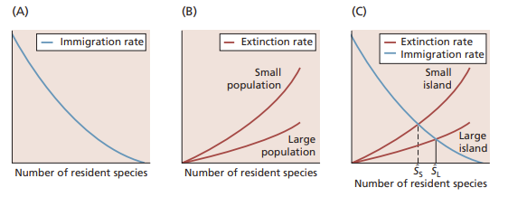{fig-align="center"}

A classic real-world example of this process was the re-colonization of birds to certain Indonesian islands during the decades following the eruption of the Krakatoa volcano in 1883.

### Equations

Equilibrium Condition: The number of species on an island $s$ is at equilibrium when the colonization rate $C(s)$ is equal to the extinction rate $E(s)$:

$$
C(s) = E(s) \tag{1}
$$

**Colonization Rate:** The colonization rate $C(s)$ depends on the total number of possible species minus the number of species $(p - s)$ and the average colonization rate $c$:

$$
C(s) = c(p - s) \tag{2}
$$

**Extinction Rate:** The extinction rate $E(s)$ depends on the number of existing species $s$ and the average extinction rate $h$:

$$
E(s) = hs \tag{3}
$$

**Equilibrium Number of Species:** By substituting equations (2) and (3) into equation (1) and solving for $s$, we can find the equilibrium number of species $s^*$:

$$
s^* = \frac{cp}{c + h} \tag{4}
$$

This equilibrium reflects the balance between colonization and extinction processes on an island, influenced by the total species pool $p$, colonization rate $c$, and extinction rate $h$.

Now let's plot this relationship in R with potential number of species of 100, average colonization rate of 0.1, and average extinction rate of 0.05

```{r}

# Define parameters


# Define the colonization `C_s` and extinction rate `E_s` functions
C_s <- function(s) {  }
E_s <- function(s) {  }

# calculate the equilibrium value  `s_star`


# Create a sequence of species numbers for plotting
s_values <- seq(0, p, by=1)

# Calculate colonization and extinction rates for each number of species
C_values <- C_s(s_values)
E_values <- E_s(s_values)

# Create a data frame for plotting
df <- data.frame(s = s_values, C = C_values, E = E_values)

head(df)

```

Now plot your results. Remember that we can plot more than one line on a single plot by defining `y` within `geom_line()`

```{r}


```

Where is the equilibrium point?

-   

## Real-World Data: Island Biogeography of Coral Reefs

Next, we'll explore the `alonso15` dataset from the `island` package[@islandPackage], which contains data on coral reef fish communities in the Lakshadweep Archipelago[@alonso2015fish].

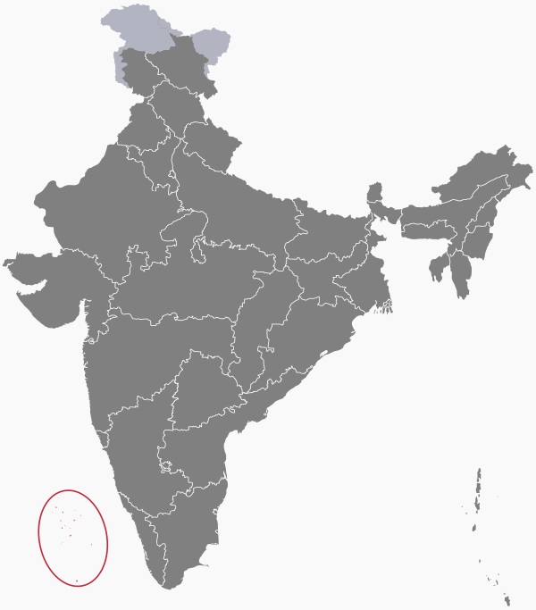{fig-align="center"}[ ](@wiki:Lakshadweep)

As always, first we will import, inspect, and clean the data

```{r}

data("lakshadweep")

head(lakshadweep)

```

```{r}

lakshadweep_AGATHI_raw <- lakshadweep[[1]]
summary(lakshadweep_AGATHI_raw)

```

```{r}

lakshadweep_AGATHI_clean <- lakshadweep_AGATHI_raw


```

```{r}

lakshadweep_KADMATH_raw <- lakshadweep[[2]]

lakshadweep_KADMATH_clean <- lakshadweep_KADMATH_raw


```

```{r}

lakshadweep_KAVRATTI_raw <- lakshadweep[[3]]

lakshadweep_KAVRATTI_clean <- lakshadweep_KAVRATTI_raw


```

Calculating extinction and colonization rates is complicated, so we will use a built-in `regular_sampling_scheme()` function provided by the [Island](https://cran.r-project.org/web/packages/island/vignettes/island.html#likelihood-and-estimating-colonisation-and-extinction-rates) package. (This function follows the stochastic implementation of Simberloff’s 1969 model [@simberloff1969experimental] developed by Alonso et al. [@alonso2015fish]). It is also still hotly debated in the scientific community.

```{r}

rates_AGATHI <- regular_sampling_scheme(x = lakshadweep_AGATHI_clean, vector = 4:30)

rates_AGATHI

```

Let's derive the necessary values we will need to derive from our dataset.

First, let's calculate $p$

```{r}

p <- length(unique(c(
  lakshadweep_AGATHI_clean$species,
  lakshadweep_KADMATH_clean$species,
  lakshadweep_KAVRATTI_clean$species
)))

```

Now let's extract the values for Agathi atoll

```{r}

lakshadweep_AGATHI_clean <- lakshadweep_AGATHI_clean %>%
  mutate(richness = rowSums(across(4:30)))

# Define functions
C_s <- function(s) { c * (p - s) }
E_s <- function(s) { h * s }

# Parameters
S_AGATHI <- lakshadweep_AGATHI_clean %>%
  filter(x2013_4 > 0) %>%
  summarize(S = sum(x2013_4)) %>%
  pull(S)

c <- rates_AGATHI$c
h <- rates_AGATHI$e

# Create a sequence of species numbers for plotting
s_values <- c(0:p)

# Calculate colonization and extinction rates for each number of species
C_values <- C_s(s_values)
E_values <- E_s(s_values)

# Create a data frame for plotting
df_AGATHI <- data.frame(s = s_values, C = C_values, E = E_values)

head(df_AGATHI)

```

```{r}

rates_KADMATH <- regular_sampling_scheme(x = lakshadweep_KADMATH_clean, vector = 4:29)

lakshadweep_KADMATH_clean <- lakshadweep_KADMATH_clean %>%
  mutate(richness = rowSums(across(4:29)))

# Parameters
S_KADMATH <- lakshadweep_KADMATH_clean %>%
  filter(x2013_4 > 0) %>%
  summarize(S = sum(x2013_4)) %>%
  pull(S)

c <- rates_KADMATH$c
h <- rates_KADMATH$e

# Create a sequence of species numbers for plotting
s_values <- c(0:p)

# Calculate colonization and extinction rates for each number of species
C_values <- C_s(s_values)
E_values <- E_s(s_values)

# Create a data frame for plotting
df_KADMATH <- data.frame(s = s_values, C = C_values, E = E_values)

head(df_KADMATH)

```

```{r}

rates_KAVRATTI <- regular_sampling_scheme(x = lakshadweep_KAVRATTI_clean, vector = 4:26)

lakshadweep_KAVRATTI_clean <- lakshadweep_KAVRATTI_clean %>%
  mutate(richness = rowSums(across(4:26)))

# Parameters
S_KAVRATTI <- lakshadweep_KAVRATTI_clean %>%
  filter(x2013_4 > 0) %>%
  summarize(S = sum(x2013_4)) %>%
  pull(S)

c <- rates_KAVRATTI$c
h <- rates_KAVRATTI$e

# Create a sequence of species numbers for plotting
s_values <- c(0:p)

# Calculate colonization and extinction rates for each number of species
C_values <- C_s(s_values)
E_values <- E_s(s_values)

# Create a data frame for plotting
df_KAVRATTI <- data.frame(s = s_values, C = C_values, E = E_values)

head(df_KAVRATTI)

```

```{r}


ggplot() +
  
  # Colonization lines
  geom_line(data = df_AGATHI,   aes(x = s, y = C, color = "Agathi")) +
  geom_line(data = df_KADMATH,  aes(x = s, y = C, color = "Kadmath")) +
  geom_line(data = df_KAVRATTI, aes(x = s, y = C, color = "Kavratti")) +

  # Extinction lines
  geom_line(data = df_AGATHI,   aes(x = s, y = E, color = "Agathi")) +
  geom_line(data = df_KADMATH,  aes(x = s, y = E, color = "Kadmath")) +
  geom_line(data = df_KAVRATTI, aes(x = s, y = E, color = "Kavratti")) +

  # Vertical lines for s_star
  geom_vline(xintercept = S_AGATHI, color = "red") +  
  geom_vline(xintercept = S_KADMATH, color = "green") +
  geom_vline(xintercept = S_KAVRATTI, color = "blue") +
  
  labs(
    title = "Colonization and Extinction Rates Across Atolls",
    x = "Species Richness (s)",
    y = "Rate",
    color = "Atoll"
  ) 


```

What can you say about these islands?

```{=plaintext}
```
## Extending the "Island Biogeography Theory" model

Although they did not derive any formulas to model this, MacArthur and Wilson theorized colonization and extinction were influenced by two main factors:

-   **Island size** ($a$), which affects the extinction rate. Larger islands support more species due to greater habitat diversity and resources. Additionally extinction rates will be lower on larger islands because of more resources.

    -   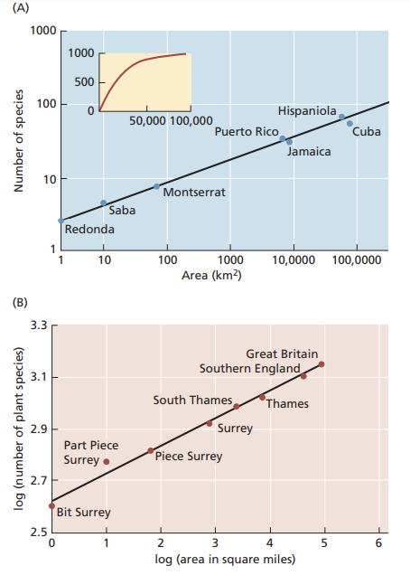
    -   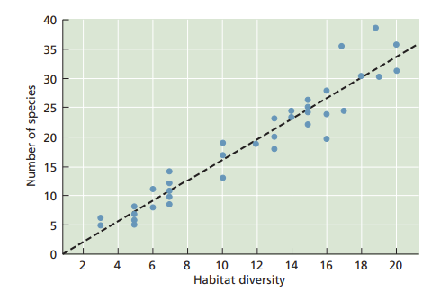

-   **Distance from the mainland** ($d$), which affects the colonization rate. Islands closer to the mainland have higher immigration rates due to proximity.

Based on these concepts, which of these islands would you expect to have a higher colonization rate, extinction rate, and/or number of species?

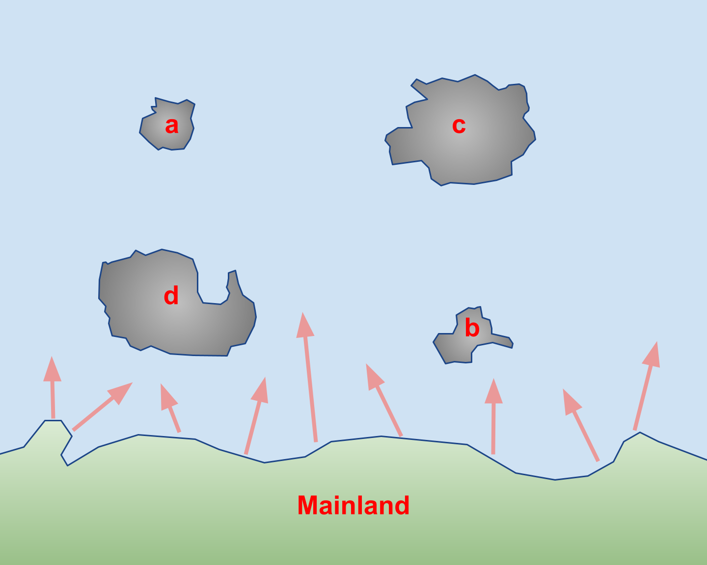{fig-align="center" width="482"}

### 

Here are two proposed ways to calculate colonization and extinction rates by incorporating area and distance ([source](https://blog.uvm.edu/tdonovan-vtcfwru/files/2020/06/11-Donovan-pages-310-EE.pdf)):

$$ C = \frac{c(P - S)}{fD} $$

$$ E = \frac{qS}{A^m} $$

**Where:**

-   *C* = colonization rate estimate

-   *E* = extinction rate

-   *P* = total number of species

-   *S* = species richness of the individual island

-   *D* = distance of the island from the mainland

-   *c* = colonization probability, or the probability that a given species will make it to the island (assumed to be equal for all species)

-   *f* = a scaling factor for distance

-   *q* = extinction probability for a given species (assumed to be equal for all species)

-   *A* = area of the island

-   *m* = a power scaling factor for area

Incorporate these modifications into our model with these values $A = 3.84$, $D = 459$, $c = 0.1$, $f = 0.01$, $m = 0.25$, $q = 0.2$, $P = 156$, and $S = 45$

```{r}

# Set the parameters

# Define the colonization and extinction rate functions


# Create a sequence of species numbers for plotting


# Calculate colonization and extinction rates for each number of species

# Create a data frame for plotting


```

Assume we have 45 species `S` in our environment. Plot with a vline at 45 using `geom_vline(aes(xintercept = S))`

```{r}


```

What would we need to do to decrease colonization rate?

-   

What would we need to do to decrease extinction rate?

-   

Is our environment currently at equilibrium?

-   

## Real-World Data: Extended Island Biogeography of Coral Reefs

We can find a reliable source for the the geological constants we need for these 3 atolls in the Lakshadweep Archipelago (from an Indian governmental website):

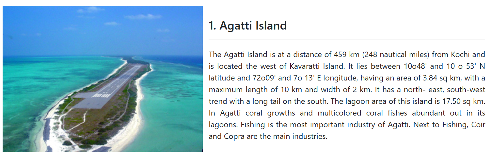{fig-align="center" width="579"}

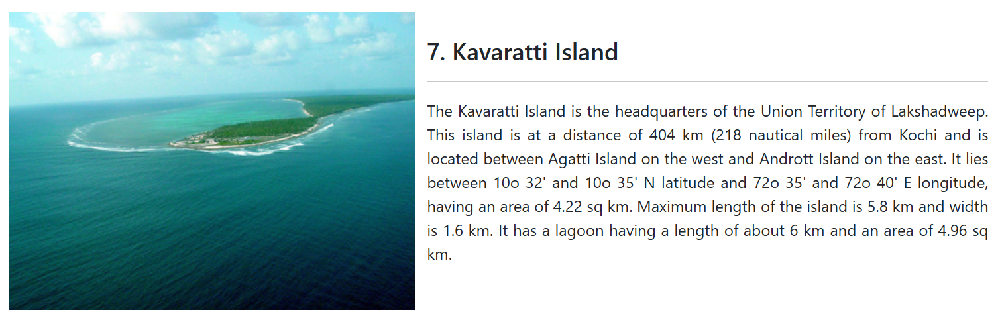{fig-align="center" width="590"}

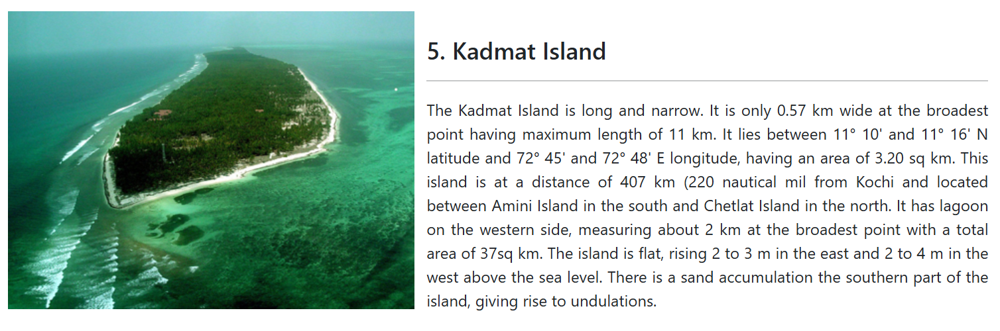{fig-align="center" width="588"}

Along with the previous values we calculated, incorporate the details about these islands into the extended model with these values $c = 0.1$, $f = 0.01$, $m = 0.25$, and $q = 0.2$.

```{r}

# Set parameters

# Set D_AGATHI and A_AGATHI


# Create a sequence of species numbers for plotting


# Calculate colonization and extinction rates for each number of species


# Create a data frame for plotting


```

```{r}

# Set D_KADMATH and A_KADMATH


# Calculate colonization and extinction rates for each number of species

# Create a data frame for plotting


```

```{r}

# Set D_KAVRATTI and A_KAVRATTI


# Calculate colonization and extinction rates for each number of species


# Create a data frame for plotting


```

```{r}

ggplot() +
  
  # Colonization lines
  geom_line(data = df_AGATHI_extended,   aes(x = s, y = C, color = "Agathi")) +
  geom_line(data = df_KADMATH_extended,  aes(x = s, y = C, color = "Kadmath")) +
  geom_line(data = df_KAVRATTI_extended, aes(x = s, y = C, color = "Kavratti")) +

  # Extinction lines
  geom_line(data = df_AGATHI_extended,   aes(x = s, y = E, color = "Agathi")) +
  geom_line(data = df_KADMATH_extended,  aes(x = s, y = E, color = "Kadmath")) +
  geom_line(data = df_KAVRATTI_extended, aes(x = s, y = E, color = "Kavratti")) +
  
  # Vertical lines for s_star
  geom_vline(xintercept = S_AGATHI, color = "red") +  
  geom_vline(xintercept = S_KADMATH, color = "green") +
  geom_vline(xintercept = S_KAVRATTI, color = "blue") +
  
  labs(
    title = "Extended Model of Atolls",
    x = "Species Richness (s)",
    y = "Rate",
    color = "Atoll"
  ) 

```

How does this model just based on area and distance compare to our earlier model which used real data? (Note the blue and green colonization lines are overlappping)

```{=plaintext}
```
## Improving on the Theory of Island Biogeography

Another oversimplification traditional models make is ignoring the paleogeological history of islands. In reality, the island which an organism or community may live on may be very different than the island its ancestors dispersed to or adapted on. For more accurate models, it would be advisable to take the geological history of islands into account when analyzing ecological communities:

![Source: Whittaker et al. 2017\[\@whittaker2017island\]](../images/clipboard-2552993429.png){fig-align="center"}

------------------------------------------------------------------------

# Metapopulations

In previous labs, we considered **closed populations**, with population size governed by birth and death. Now we are going to consider all important terms of the *BIDE* model [@pulliam1988sources]: birth, immigration, death, and emigration. Therefore, we are going to expand our models to include the interaction *among* populations.

First described by H. G. Andrewartha and Charles Birch in 1954 [@andrewartha1954distribution] and later being named by Richard Levins in 1969 [@levins1969some] in the context of pest management, **metapopulations** is the term for these "populations of populations."

Currently, in the context of conservation biology metapopulation theory has largely replaced the theory of island biogeography. In particular, the Levin's Metapopulation Model helps us understand how habitat loss may affect species persistence.

## Levin's Metapopulation Model

Recall the simplest Lotka-Volterra Predator/Prey model we covered:

$$
 \begin{array}{l}
\frac{dN}{dt} \ =\ rN\ -\ aNP\\
\\
\frac{dP}{dt} \ =\ faNP\ -\ qP
\end{array}
$$

Add a term for density dependent growth of the prey species

$$
\begin{array}{l}
\frac{dN}{dt} \ =\ rN\ \left( 1\ -\ \frac{N}{K} \ \right) \ -\ aNP\\
\\
\frac{dP}{dt} \ =\ faNP\ -\ qP
\end{array}
$$

Now simplify the population decline term of the prey species $aNP$ based on the predator decline terms $qP$

$$
\begin{array}{l}
\frac{dN}{dt} \ =\ rN\ \left( 1\ -\ \frac{N}{K} \ \right) \ -\ qP\\
\end{array}
$$

The Levin's metapopulation model is similar to this population growth function, but it is concerned with the proportion of patches that are occupied

$$
\frac{dP}{dt} \ =\ cP\ ( 1\ -\ P) \ -\ mP
$$

Where:

$$
\begin{array}{l}
P\ =\ proportion\ of\ occupied\ patches\\
c\ =\ colonization\ rate\\
m\ =\ rate\ of\ extinction
\end{array}
$$

Instead of carrying capacity limiting population growth as seen in the Lotka-Volterra model, in the Levin's Metapopulation model the self-limiting portion $(1 - P)$ is the proportion of empty patches. $P + (1 - P)$ must always equal what?

$$
P + (1 - P) = 1
$$

Because of the inclusion of the term $(1 - P)$, this equation represents a **closed metapopulation**:

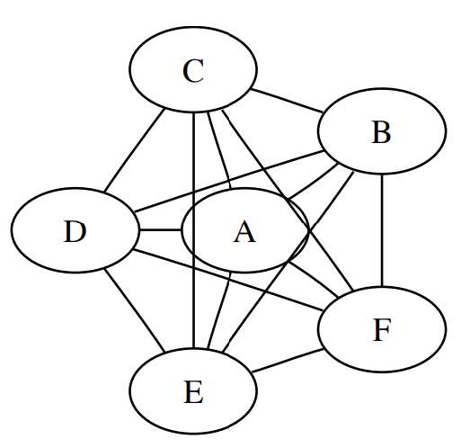{fig-align="center"}

Recall from past labs this semester, the general layout for partial derivative functions with the `deSolve()`[@deSolve] package:

```{=plaintext}

function_name <- function(y, x, parms) {
  X <- x[1]
  with(as.list(parms), {
    dX.dy <- X # complete formula here
    return(list(c(dX.dy)))
  })
}

function_name.out <- deSolve::ode(x = X0, times = times, func = function_name, parms = parms)
```
Write a function `levins()` for the Levin's metapopulation model with `parms <- c(c = 0.15, m = 0.06)`, `P0 <- 0.01`, and `times <- 1:100`

```{r}


```

Now plot (remember to use `ggplot2`[@ggplot2], we have to first convert our dataset to a dataframe)

```{r}


```

## Habitat Destruction

Russel Lande[@lande1987extinction] found that habitat destruction $D$ can be easily integrated into the simpler form of the Levin's metapopulation model where $D = 1$ is complete destruction and $D = 0$ is the default Levin's metapopulation model.

$$
\frac{dP}{dt} \ =\ cP\ ( 1\ -\ D - P) \ -\ mP
$$

Integrate habitat destruction `D = 0.2` into the Levin's metapopulation model to create a function for the `lande()` model over period `times <- 1:200`.

```{r}


```

Plot the Lande model output using `ggplot2`

```{r}


```

What happens to the curve as you vary `D`?

-   

-   

This is an important reminder of the importance of *empty* patches.

------------------------------------------------------------------------

## Metapopulation Dynamics

In this lab, we have already worked with simple models of metapopulations and dispersal using the Levin's Metapopulation Model/Lande Model. Recall from lecture the four perspectives to characterize how dispersal rates and environmental heterogeneity interact to influence species diversity in metacommunities.

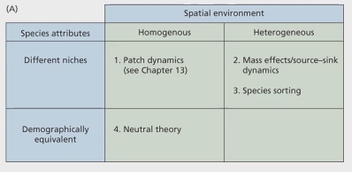{fig-align="center"}

![Source[@mittelbach2019community]](../images/clipboard-1032489053.png){fig-align="center"}

1.  Patch dynamics perspective - patches are homogeneous, dispersal ability is heterogeneous, so determinant is only dispersal ability

2.  Species sorting perspective - patches are heterogeneous, dispersal ability is equivalent, so determinant is abiotic/biotic filters

3.  Mass effects perspective - patches are homogeneous, high dispersal overall, so determinant is dispersal ability where bad patches (sinks) are being rescued by dispersal from good patches (source)

4.  Neutral perspective - patches are homogeneous, dispersal ability is equivalent, so no determinant. Random and/or determined by timing (if a species happens to colonize first)

These perspectives cannot be fully represented in a Levin's Metapopulation Model/Lande Model alone.

To explore these perspectives, we are going to be using the package `mcomsimr` as presented in the article [A process-based metacommunity framework linking local and regional scale community ecology](https://onlinelibrary.wiley.com/doi/10.1111/ele.13568)[@thompson2020process] and more information is provided on the project's [GitHub page](https://github.com/plthompson/mcomsimr).

*Note that the exact code in the article was written in `Julia`, not `R`*

This package allows you to easily model the following simultaneously and integrates stochaisticity:

1.  Density independent responses to abiotic conditions

2.  Density dependent competition

3.  Dispersal

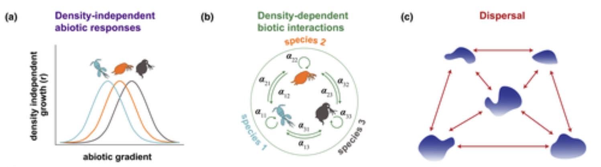{fig-align="center"}

<details>

<summary>As the most basic implementation, you can vary the amount of patches and species with the following arguments:</summary>

```{r}
simulate_MC(patches = 5, species = 4)
```

</details>

Review the "help page" for the function `simulate_MC()` using your console (`?simulate_MC`). With this information, simulate each of the four perspectives using the `simulate_MC()` function and discuss briefly what you observe.

```{r}

# ?simulate_MC()

```

<details>

<summary>

1)  Patch dynamics perspective

High or lower dispersal, low response to environmental heterogeneity

(Note that a high number (e.g. 10) for `env_niche_breadth` means low response, because more of a generalist. Conversely low number (e.g. 0.5) means high response. Dispersal can range from 0.1 to 1.)

</summary>

```{r}

simulate_MC(patches = 5, species = 4, dispersal = 0.9, env_niche_breadth = 10)

```

</details>

-   landscape: Scatter plot that shows where the plots are located

    -   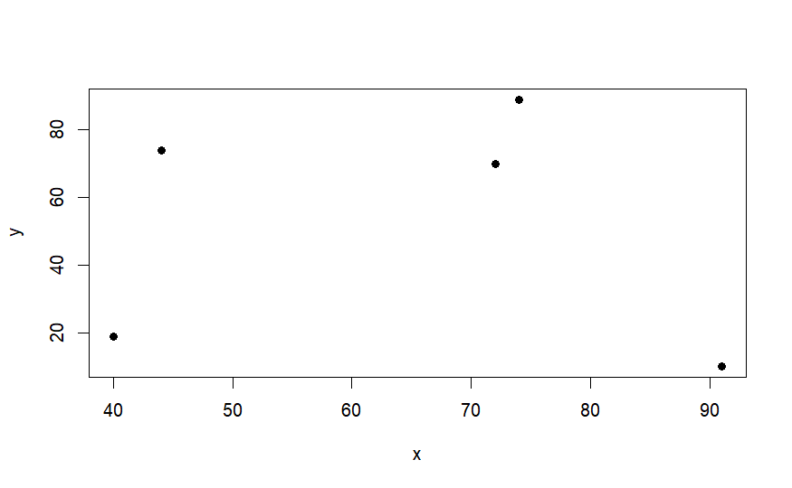{width="407"}

-   disp_mat: Heatmap that shows dispersal rates and how they differ between close and distant plots

    -   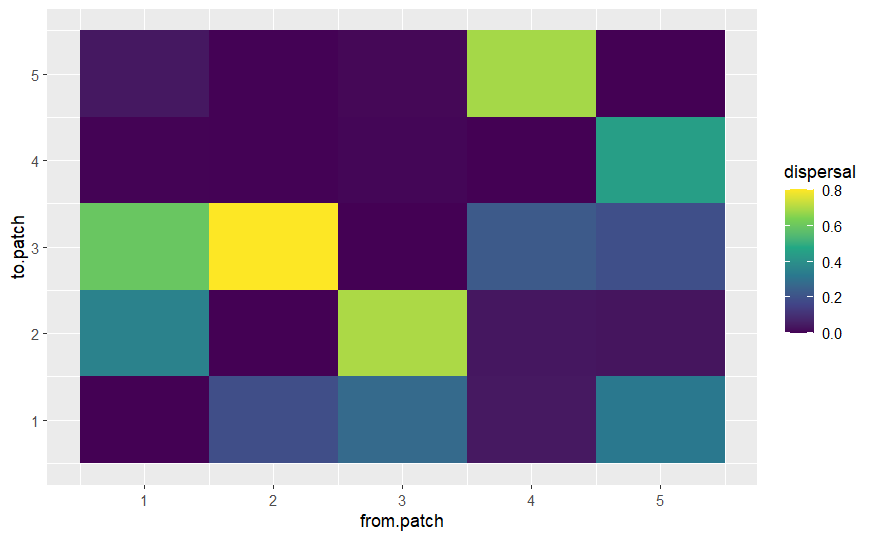{width="390"}

    -   For the "patch dynamics perspective," patches are homogeneous so we can either see high or low dispersal because all patches identical. In this case we see high dispersal (lowest heatmap values along the diagonal where to.patch and from.patch values equal).

-   dynamics.df: This timeseries plot show how populations grow and decline due to interactions with other species, environmental conditions, and possibly stochastic events.

    -   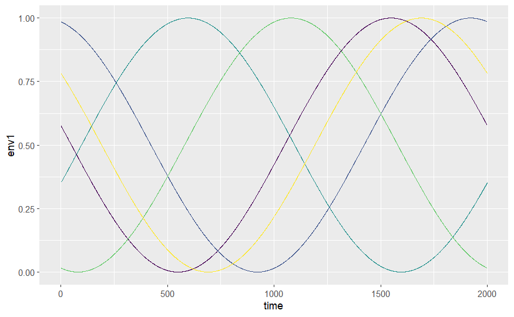{width="380"}
    -   Time series curves are asynchronous with one another. Overall, how patch dynamics work is that there is a trade-off between competition and colonization which we can see here.

-   env.df: This response curve shows how the environment changes in each patch over time

    -   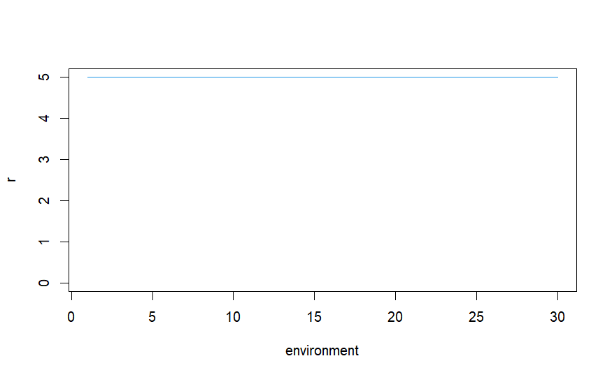{width="373"}

    -   For the "patch dynamics perspective" there is no difference in patches, so the response to environmental differences is the same over time

-   int_mat: A competition matrix that visualizes the strength of competitive interactions between pairs of species

    -   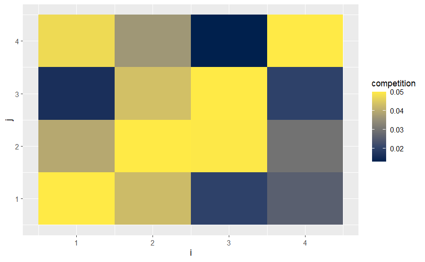{width="363"}

    -   The default setting for this package is that 30% of species will be dominant, so we are seeing that affect here. Remember there is a trade-off between competition and colonization.

-   These time series plots represent the environmental optima over time for each species faceted by each patch

    -   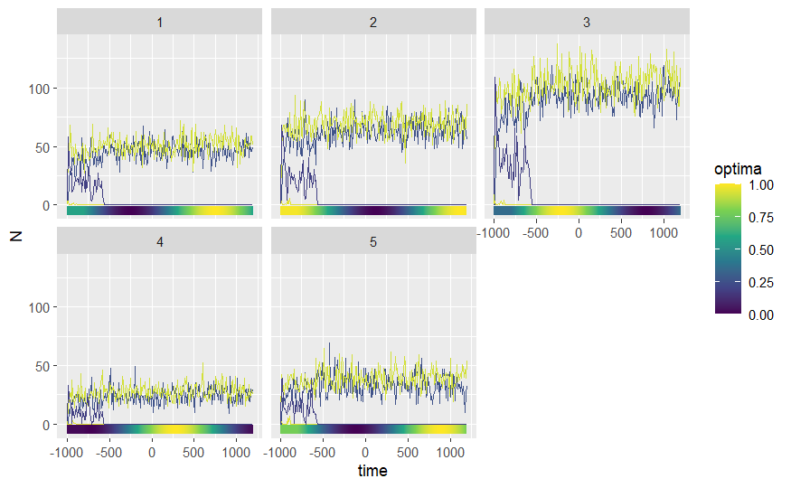{width="340"}

    -   Because each species and each patch are equal in the "patch dynamics perspective," each patch is taken over by a subset of species and the rest are excluded. That is why we see these "ranked" optimums of 3 \> 2 \> 1 \> 5 \> 4. This reflects the order of colonization (and exclusion) but not patch quality since all patches are equal.\

------------------------------------------------------------------------

# References
